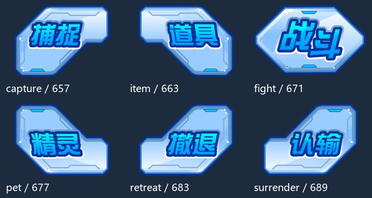

# Flash 右侧操作按钮

2026-10-01 从项目缓存的官方 Flash 战斗包静态导出，已逐张查看并对照用户截图。外形对应截图右下角的五向按钮布局；本次没有修改场景或按钮脚本。

| 文件前缀 | 含义 | CharacterId | 原元件路径 |
|---|---|---|---|
| capture | 捕捉，左上 | 657 | fight_mainPanel → controlMC → catch_btn |
| item | 道具，右上 | 663 | fight_mainPanel → controlMC → item_btn |
| fight | 战斗，中间 | 671 | fight_mainPanel → controlMC → fight_btn |
| pet | 精灵，左下 | 677 | fight_mainPanel → controlMC → pet_btn |
| retreat | 撤退，右下 | 683 | fight_mainPanel → controlMC → btnMc → escape_btn |
| surrender | 认输，同右下位置的另一种用途 | 689 | fight_mainPanel → controlMC → btnMc → surrender_btn |

每组四张透明 PNG：`*-up.png` 普通、`*-over.png` 悬停、`*-down.png` 按下、`*-hittest.png` 点击区域参考。hittest 不作为可见背景；原包没有提供独立的 disabled 状态，禁用反馈需要本项目处理。

`control-reference.png` 是整个 controlMC（CharacterId 691）的首帧静态参考，包含底板与设计时头像，不能当成可直接投入使用的完整操作区。设计时头像、按钮功能和数据应在 Unity 中分别配置。

来源：[官方 Flash 战斗模块](https://seer.61.com/dll/PetFightDLL_201308.swf)。使用本地缓存 `docs/OfficialReference/20261001/fight.swf`；SHA-256 为 `d3382d52150d1189e24664f840090b80d923fbdb4ee831ee78e4fc03f3dcc6df`，与项目此前缓存一致。此次不是重新下载游戏包；文件名中的 201308 不作为素材年代证明。

JPEXS 26.2.1 按 3 倍比例静态渲染 DefineButton2，未执行 ActionScript。每张输出去掉全透明外边距；`sources.json` 保留原画布尺寸、裁切范围、CharacterId、状态和输出校验值。普通与悬停的裁切框可能不同，切换状态时应按原画布位置对齐，避免外观跳动；可依据清单补回统一透明画布，或者为 Sprite 配置对应的注册点。

## Unity 装配建议

2026-10-01 已在 `Battle` 场景和 `Assets/Prefabs/BattleUI/SwitchMenu.prefab` 中为五个菜单按钮接入 `ActionMenuButton`：悬停切换 over，左键按下切换 down，松开点击时触发 0.24 秒青蓝色叠加发光并渐退。使用非缩放时间；禁用按钮或组件时清除反馈。点击只通过 `OnClick` / `Clicked(actionId)` 报告意图，战斗功能由外部订阅。

over/down 的 Sprite 自定义注册点已根据 `sources.json` 对齐到 up 的中心；原 PNG 保持不变。PolygonCollider2D 使用普通状态的轮廓，发光子层无碰撞器。场景已配置 EventSystem 与 Physics2DRaycaster。可通过 Unity 菜单 `Tools/ReSeer/配置菜单按钮点击特效` 重新配置；复用预制体的其他场景也需要事件系统和相机上的 Physics2DRaycaster。

运行验证与状态截图保存在 `docs/Verification/ActionMenuEffects/`。

可沿用当前 SpriteRenderer + BoxCollider2D 按钮方式，用三态图片切换反馈。不强行改为 uGUI。按钮只报告 OpenItems／OpenPets／OpenSkills／CaptureRequested／EscapeRequested 等意图，由操作区处理。是否允许捕捉、撤退、认输由上层战斗可选行动控制。

这些是不规则按钮，矩形碰撞框直接相邻容易重叠。按 hittest 形状配置 PolygonCollider2D，或使用不会互相覆盖的较小点击范围。装饰底板不接收点击。

完整静态资源与第五技能的设计说明见同级 `../FifthSkill/README.md`。
