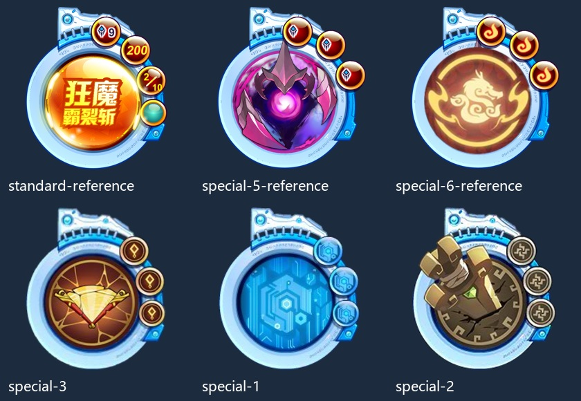
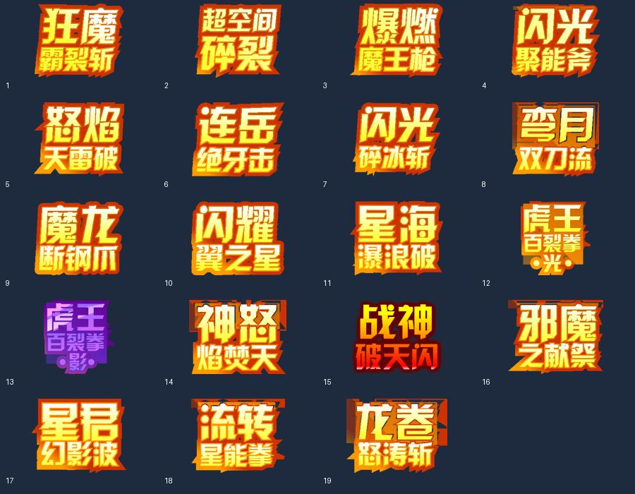

# Flash 第五技能元件与可替换组件设计

后续已实现一个普通第五技能按钮与独立示例，使用方法见 `docs/第五技能按钮使用.md`。新增 `Parts/center-button-up/over/down/hittest.png` 为 CharacterId 381 的中心橙色按钮四态，保持相同 461 × 465 画布。下文“未实现”描述保留的是最初资源整理时的情况；特殊第五插槽框架仍未实现。

2026-10-01 从官方 Flash 战斗包中定位并静态导出。不是从用户截图裁切；截图只用于对照位置与外形。本次新增资源与设计说明，没有实现或挂载 Unity 组件。



## 找到了什么

| 文件／目录 | 内容 | CharacterId |
|---|---|---|
| standard-reference.png | hideSkillMC 完整设计时首帧；名称和数字是原包示例 | 475 |
| Parts/standard-ring.png | 普通第五底圈，与项目原 fifth-ring 同源 | 358 |
| Parts/mechanical-header.png | 顶端蓝白机械装饰 | 371 |
| Parts/standard-center.png | 中间底层圆面 | 372 |
| Parts/side-orb.png | 空白侧边圆形标记底板 | 387 |
| Parts/side-marker.png | 带原设计时图案的侧边标记参考 | 473 |
| CenterEffect/001.png–068.png | 中心动效时间轴的 68 帧 | 442 |
| NameArt/001.png–019.png | 19 个技能名称美术帧；不同名称，不是动画 | 469 |
| special-1.png / Parts/special-1-base.png | 蓝色芯片盘 | 2098 / 2097 |
| special-2.png / Parts/special-2-base.png | 拳头盘 | 2101 / 2100 |
| special-3.png / Parts/special-3-base.png | 金色菱形盘 | 2095 / 2094 |
| special-5-reference.png | 紫色徽记第五的设计时组合首帧 | 2084 |
| Parts/special-5-ring.png / special-5-emblem.png | 对应底圈与紫色徽记 | 2081 / 2083 |
| special-6-reference.png | 金红徽记第五的设计时组合首帧 | 2092 |
| Parts/special-6-ring.png / special-6-emblem.png / special-6-orbs.png | 对应底圈、徽记与三颗空白标记底板 | 2085 / 2087 / 2088 |

上述特殊元件的原导出名为 `hideSkill_locked_1/2/3/5/6`。本包未找到对应的 `_4` 导出符号。名称包含 locked 不足以确认具体玩法、精灵对应关系或每颗图标的意义；本次只确认元件结构和显示原件。

用户截图的第五标题“万象……”不在本次导出的 19 个名称帧中，不把其他技能文字当成同款名称。标准圆盘结构、右侧按钮外形已经对照；第五运行时标题、数值和特效仍需由本项目绑定。实际实例在运行时可能会隐藏设计时层；静态完整首帧仅用于参考。



`authored-layout.json` 记录完整第五与控制区的子元件、名称、层级深度和变换。Flash 原坐标使用 twip，20 twip = 1 原始像素；导出比例为 3。恢复装配时先转换单位，别直接用导出图片中心猜注册点。每张裁切的原始外边距见 `sources.json`。

动画帧保持同一个 627 × 617 透明画布，名称帧保持同一个 345 × 327 画布，避免逐帧裁切引起跳动。原 SWF 帧率 24；这只是作者时间轴参考，不证明运行时总是按 24 fps 连续播放。NameArt 的 19 帧是切换名称，不应循环播放。

## 第五区应该支持自定义组件

第五技能区建议是一个可替换的 Prefab 插槽。固定的仅是外部接口与交互边界；内部允许普通技能圆盘、芯片盘、拳头盘、带多颗标记的徽记盘拥有各自的布局和动画。

```text
BattleActionController
    └── FifthSkillSlot
          └── 当前 FifthSkillView Prefab
                ├── StandardFifthView
                ├── ChipFifthView
                ├── EmblemFifthView
                └── 以后真正需要的新变体
```

Slot 负责选择并挂载当前精灵对应的 Prefab、绑定最新数据、接收 View 的点击并向操作区报告；换精灵或换变体时解绑旧实例并停止旧动画。View 负责组件内部的文字、布局、反馈和动画。现在只需明确这一个替换边界，不必建立插件框架或全局事件总线。

可以使用一个小的 MonoBehaviour 基类（职责示意，尚未实现）：

```csharp
public abstract class FifthSkillView : MonoBehaviour
{
    public event Action<int> ActionClicked;

    public abstract void Render(FifthSkillViewData data);
    public abstract void SetInputEnabled(bool enabled);

    protected void ReportClick(int optionIndex)
    {
        ActionClicked?.Invoke(optionIndex);
    }
}
```

`optionIndex` 指当前上层给出的合法可选行动列表，不让特殊 View 自己拼网络命令或确定伤害。若只有普通第五技能，列表只有一个选项。提示图标点击只展示说明，不能冒充战斗行动。

### 哪些统一，哪些可以变

| 统一边界 | 允许变体自行实现 |
|---|---|
| 当前战斗／精灵身份、技能栏位和合法行动 | 元件外形、动画和局部排布 |
| 已确认 PP、CanSelect、禁用原因 | PP 或计数的呈现方式 |
| 全局输入锁定 | 悬停、按下、蓄能等视觉反馈 |
| 向上报告点击意图 | 标记数量、徽记和局部说明 |

如果三颗侧边标记只是信息，就做纯显示组件。只有规则明确允许点击它们时，才给它们可选行动；不能因为素材看起来像按钮，就给它们虚构玩法。

### 显示数据建议

`FifthSkillViewData` 最少包含：ViewKey、当前精灵实例身份、SkillSlot、Name／NameArtKey、CurrentPp／MaxPp、CanSelect／DisabledReason，以及该变体实际需要的标记显示数据与可选行动。

ViewKey 选择表现 Prefab；SkillSlot 和行动标识决定向上提交什么。两者分开，避免以图片名称推断技能规则。简单 ViewKey → Prefab 配置表即可；对确实不同的布局使用独立 Prefab，对只换色／图标的变体共享同一 View。

名字、PP、充能、计数由上层提供。View 不扣 PP、不推进回合，也不因动画播完擅自开放输入。控制器必须先锁输入再提交，避免普通第五与特殊第五同时留下可点击实例。

## 来源与验证

来源：[官方 Flash 战斗模块](https://seer.61.com/dll/PetFightDLL_201308.swf)，使用项目缓存 `docs/OfficialReference/20261001/fight.swf`。源 SHA-256 为 `d3382d52150d1189e24664f840090b80d923fbdb4ee831ee78e4fc03f3dcc6df`。

JPEXS 26.2.1 按 3 倍静态渲染；未执行 ActionScript。所有 106 张第五相关 PNG 已验证可解码；完整参考与零件总览已目视检查。状态和名称数据是设计时参考，未验证其正式服运行行为。
