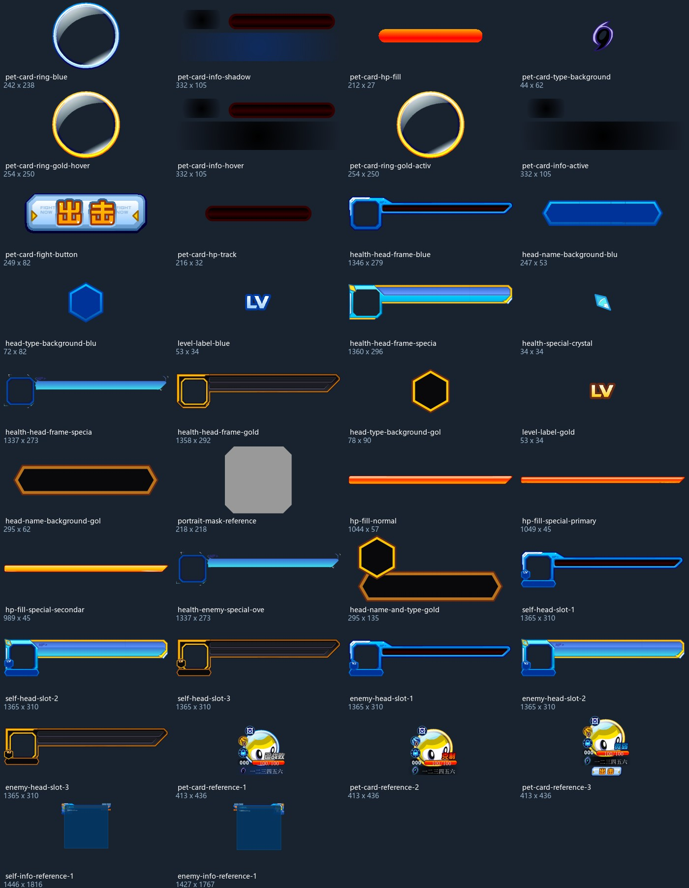
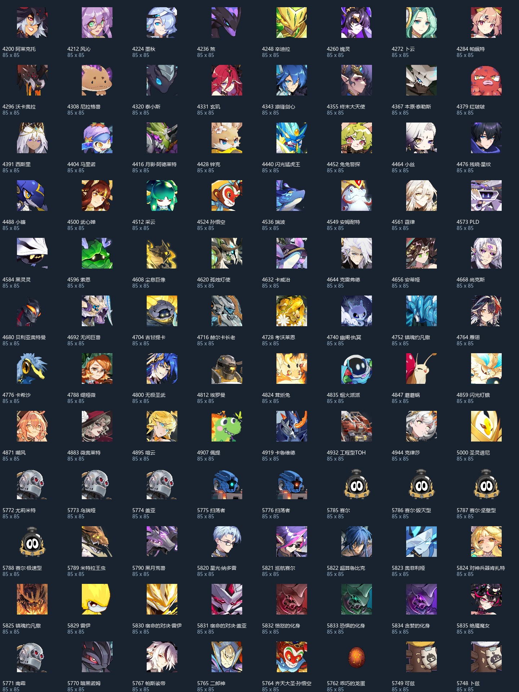
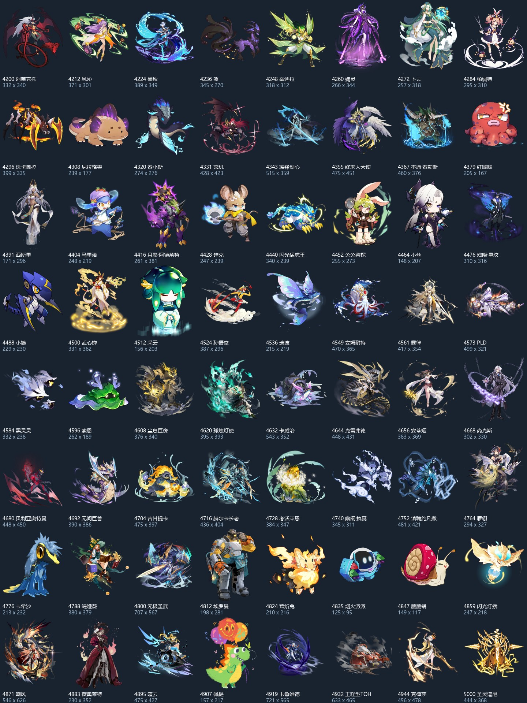
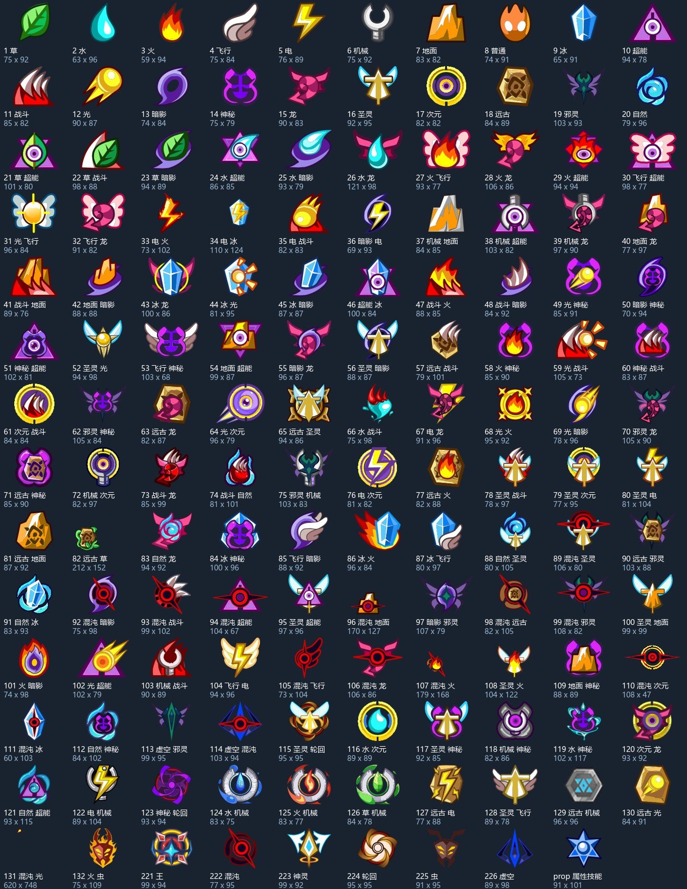

# Flash 战斗 UI 批量测试素材

采集日期：2026-10-06。图片来自公开官方 Flash 资源，静态渲染为透明 PNG；下载的 SWF 留在 `docs/OfficialReference/20261006`，不进入 Unity 运行逻辑。本批素材供精灵图框、体力头像槽和批量换图验证使用，尚未接入场景。

本批共 **337 张 PNG**：38 张 UI 原件与组合参考、96 张头像（64 张与战斗首帧配套，另 32 张较新编号头像）、64 张战斗首帧、139 张属性／属性技能图。全部已检查解码、非空透明图形、尺寸、逐文件 SHA-256 和 Sprite 导入文件；四张总览已目视检查。

## 直接选用

| 目录 | 内容 | 用法 |
|---|---|---|
| `UI/Parts` | 精灵卡片圆框、头像与血条框、体力填充、名字底板、属性底板、头像遮罩 | 分层装配，头像、文字和体力数据单独绑定 |
| `UI/self-head-slot-1/2/3.png` | 我方普通、特殊、金色头像体力槽 | 同组保持相同画布，切换不会因逐张裁切产生位置跳动 |
| `UI/enemy-head-slot-1/2/3.png` | 对方三个对应槽位 | 原父层有水平镜像，按照层级矩阵装配，不要仅凭文件名判断朝向 |
| `UI/*reference*.png` | 原设计时组合参考 | 含占位头像、示例数字、提示或蓝色占位矩形；不能作为运行时完整面板 |
| `Assets/Art/Pet/avatar` | 按精灵编号命名的头像（已迁移） | 与 `Pets/catalog.csv` 或 `catalog.json` 联查中文名和属性编号 |
| `Assets/Art/Pet/pets` | 按编号命名的完整战斗元件首帧（已迁移） | 与同编号头像配套；这是静态首帧，不是战斗动画或骨骼资源 |
| `Assets/Art/UI/Types` | 138 种属性原图，加 1 张属性技能图 | 数字文件名就是官方属性 ID；`prop.png` 对应属性技能 |

所有 PNG 配有 Unity Sprite 导入设置和独立 GUID，保持透明度，不生成 mipmap。UI 与属性矢量按 3 倍导出，精灵图按 1 倍导出；PNG 像素尺寸不是 Flash 原界面的逻辑尺寸。现有场景和预制体未修改。

## 图框与体力槽

常用组合：`health-head-frame-blue` + 独立头像 + `hp-fill-normal`；批量精灵卡片可用 `pet-card-ring-blue` + 独立头像 + `pet-card-hp-track` + `pet-card-hp-fill`。金色卡框和悬停信息底板也分别保留。

头像体力槽来自 `fight_mainPanel → MyInfoPanel / OtherInfoPanel → headRect`，CharacterId 分别为 493 / 783，精灵切换卡片来自 `petMC`（325）。`UI/authored-layout.json` 保存相关元件的逐帧放置、移除、深度、名称和矩阵；20 twip = 1 Flash 原始像素，矩阵不能直接当 Unity 像素使用。

`UI/self-info-reference-1.png` 与对方参考图包含大块设计时占位底板。优先使用拆开的原件，避免将占位底板、占位精灵或示例名字带进实际 UI。

## 精灵批量测试

从 4200–5020 段的实际精灵编号抽取 Flash 战斗样本，跳过配置中标记 `RealId` 的别名；另取官方配置中较新编号的 32 只精灵头像。遇到头像链接 404 时保留失败记录，并向前选择其他较新编号补足；最终较新头像样本为 5748–5835 段。样本实际成功数量、失败原因及图片路径以 `Pets/catalog.json` 为准。不要将编号段当作发布时间证明。

较新精灵已部分使用骨骼资源，未给它们填入其他精灵的战斗图。仅有头像的条目在 CSV 的 `fight` 列为空；`latestHeadsOnlyIds` 列出这组头像样本。它们可用于头像槽与长名字测试。

战斗图导出的是 `pet` 元件自身首帧的完整边界，避免主舞台裁掉左右两侧。只移除透明外边距，不缩放、不翻转、不重绘；清单保留原画布与裁切范围。首帧可能包含光环或其他子层，不能直接推断为官方运行时待机状态。

建议依次测试：六头像同时显示、长名字与双属性、极宽或极高立绘、满体力／半体力／1 点／0 点、我方与对方镜像、换图后位置保持。素材目录提供图片与索引，不新增战斗规则或测试运行器。

## 属性图

`Types/catalog.json` 保存中文名、英文名、双属性组成和原始 CharacterId。当前公开 Flash UI 包导出 26 种单属性、112 种双属性，以及属性技能图，共 139 张 PNG；当前配置中的属性 ID 133 在此 UI 包中没有对应导出符号，明确记为缺失。

部分原元件画布尺寸差异很大，例如属性 131（混沌光）包含很大的边界和边缘零散像素。保留原始导出结果供排查，使用时应依据实际图形尺寸配置，不把所有源画布宽高当成统一图标尺寸。

## 来源与复现

来源为 [Flash 战斗模块](https://seer.61.com/dll/PetFightDLL_201308.swf)、[Flash UI 库](https://seer.61.com/dll/UI.swf)、[官方精灵配置所在模块](https://seer.61.com/dll/RobotCoreDLL.swf)，以及官方 `resource/pet/head/{编号}.swf` 和 `resource/fightResource/pet/swf/{编号}.swf`。每张 PNG 的来源 URL、原包 SHA-256、输出 SHA-256、元件编号、导出比例和尺寸记录在根 `sources.json`；精灵失败记录在清单中，404 页面不会保存成图片。

本次重新下载当前三个模块。相关 UI 元件与此前缓存逐标签比较相同，保留的 `authored-layout.json` 来自这些相同的元件标签。模块文件名里的 `201308` 不作为年代证明。

使用 `tools/collect_flash_battle_assets.py` 复现采集，依赖 requests、Pillow、Java 和 `Temp/FFDec/ffdec.jar`（JPEXS 26.3.0）。首次配置需提供该离线导出工具；下载包和导出中间结果仅存缓存。脚本不执行官方 ActionScript、不登录、不访问战斗服务器。

沿用项目已有的本地学习与同人原型研究用途，素材权利归原权利人。
