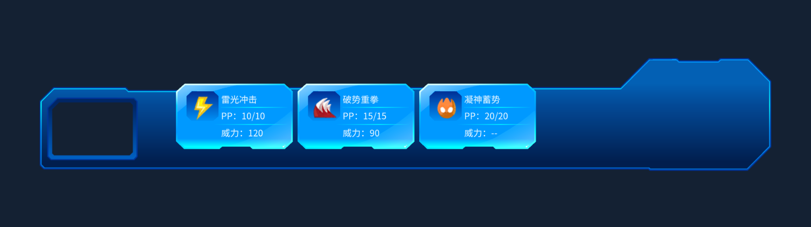

# MainActionPanel 动态技能槽

选中 MainActionPanel，在 Inspector 点击 **Test：生成三个技能槽**，即可在编辑模式查看雷光冲击、破势重拳、凝神蓄势。也可以通过组件右键菜单调用 Test。默认不在 Start 自动加载演示数据。

在 MainActionPanel 组件直接修改公开的 **X、Y、Spacing**，已有技能槽会立即重新排列。X、Y 是相对于面板的起始坐标；Spacing 是相邻槽的水平步距，包含按钮宽度，使用世界单位。点击“清除 Test 预览”移除临时槽。临时槽不保存到场景或预制体，在脚本重载或进入播放模式时清除。



- MainActionPanel 选择预览数据并向外转发 SkillSelected。
- SkillPanel 根据列表创建、绑定和清理 SkillButton。
- SkillSlotLayout 排列 SpriteRenderer 按钮，默认一行四列。三个技能只生成三个槽，不生成第四个占位按钮。
- SkillButton 显示名称、属性图标、威力、当前 PP，并上报所选 SkillData。点击不在按钮内扣 PP。

当前演示使用满 PP。接入精灵或战斗数据时，关闭 MainActionPanel 的 Load Preview On Start，并调用：

```csharp
mainActionPanel.ShowSkills(petSkills, remainingPp);
mainActionPanel.SkillSelected += OnSkillSelected;
```

两份列表必须长度一致，剩余 PP 由调用者提供。退出时配对解除订阅。即使保持预览开关，Start 前已传入的真实数据也不会被演示覆盖。

技能库现有第四条电磁脉冲未列入此次演示。第五技能的脚本、资源、示例和场景摆放保持现状；普通技能容器不会清理第五技能对象。

修改列数或换行距离时，在 SkillContainer 的 SkillSlotLayout 中调整 Columns、Cell Step 的 Y。水平步距由 MainActionPanel 的 Spacing 控制。当前面板采用 SpriteRenderer，不使用 Canvas 的 GridLayoutGroup。

菜单 `Tools → Re-Seer → 配置动态技能槽并验证` 可重新配置 MainActionPanel 的容器和引用，并在独立预览场景中检查生成数量、PP 与选择事件。菜单会更新 MainActionPanel 预制体，重新生成截图和 `Logs/main-action-panel-verification.txt`；不保存当前场景。
