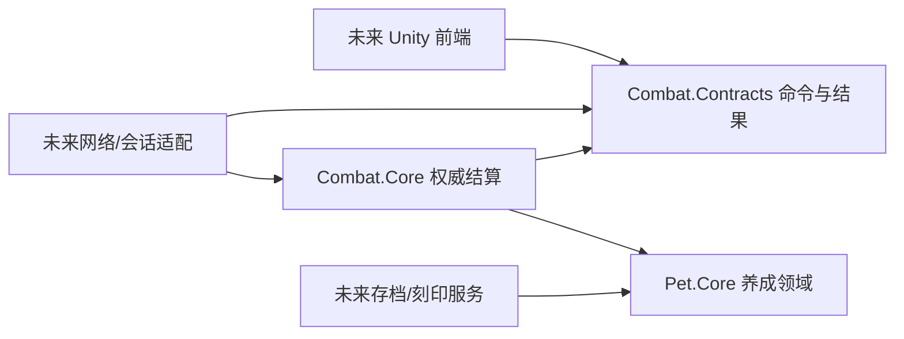

# 基础骨架、Effect 的取舍与前后端边界

2026-09-09 · 本轮已开始实现基本类与单挑循环。旧 Unity 训练场仍使用原内核，新内核位于 `Assets/Scripts/Combat`，命名空间 `ReSeer.Combat`。它是可独立构建、可测试的切片，不是完整服务器成品。

## 1. Effect 到底要不要伤害、回复子类

我的建议是：**按不同的行为规则拆类型，按不同的数值组合做配置。保持很浅的继承，不为每个招式造子类。**

判断依据不是“伤害和回复听起来像两个名词”，而是两者是否需要不同的输入、约束和处理流程。

伤害以后会涉及攻防、物理/特殊类别、减伤、护盾、反伤和击倒；回复会涉及缺失生命、治疗修正、禁疗和过量治疗。将这些字段全部放进万能 Effect，会出现大量无意义组合：治疗却填反伤类型、伤害却填溢出治疗规则。独立类型能让这些错误更早暴露，也让一处机制变更只影响相关代码。

但“10 点伤害”和“100 点伤害”没有新的行为，不需要两个类。火系伤害和电系伤害通常也只是参数不同；除非某一类真的有独立结算过程，否则不再往下继承 FireDamageEffect、ElectricDamageEffect。

### 可选方式的代价

| 做法 | 优点 | 代价与适用范围 |
|---|---|---|
| `Effect` 加枚举和一个大 switch | 初期代码集中、查找方便 | 行为增长后参数和分支混杂；少数固定操作时可以接受 |
| `DamageEffect / HealEffect` 等浅层类型 | 参数和约束明确，可独立验证行为 | 会增加文件；应避免继续按每个技能细分子类 |
| `Effect` 持有回调/委托 | 原型快，临时特殊规则易表达 | 难以稳定序列化和追溯，闭包可能误捕获某局状态；不能作为客户端提交的执行内容 |
| 完整可视化节点/表达式语言 | 能由策划编辑许多组合 | 相当于维护一个小语言，需要解释器、验证、调试与迁移；现在投入过大 |

继承本身不是目的。Effect 的共同契约只需要表达“根据上下文产生什么结算”，不能强迫所有类型实现一堆没有意义的方法。将来出现纯查询修正效果，再单独评估修改草案的契约，不让每个伤害效果都实现空的 Modify 方法。

### Effect 与 Event 看上去重复，为什么还分开

Effect 回答“这个内容具有什么行为”，可以被许多招式复用；Event 回答“这一次行为怎么执行、由谁引起、最后发生了什么”。

例如 DamageEffect 可以是固定伤害、按剩余生命决定伤害、先检查条件再生成多段伤害，最终都提交 DamageEvent。DamageEvent 统一处理实际生命损失、过程编号和事实记录。于是规则的表达可以变化，状态提交的约束仍集中在一处。

最简单的固定伤害确实只有一行转发，多这一层暂时显得薄；它为 Skill/Trait/Status 共用行为保留了边界。如果以后整个游戏始终只有少数固定操作，也可以用一个不可变操作配置代替具体 Effect 类，不必为了架构图坚持继承。

**本轮选择**：一个 Effect 抽象入口，只实现固定伤害 DamageEffect 来跑通组合；没有预先制造 HealEffect、全部状态子类或通用 Modifier。当前 Skill 直接持有有序 Effect 列表。概率/时机/目标挂载配置、Trait 和持续状态留到下一切片，未假装已经实现。

## 2. 调整 Pet 的概念

此前草案把 Pet 当作物种模板。本轮根据“Pet 包含养成”的要求，正式改为三层：

| 类 | 放什么 | 不放什么 |
|---|---|---|
| `PetSpecies` | 物种编号、名称、元素、种族值、学习表、素材索引 | 这只精灵的经验、学习力 |
| `Pet` | 持久化个体编号、昵称、等级、累计经验、个体值、性格、学习力、已学/携带技能、刻印装备 | 当前对战的 HP、PP、随机结果 |
| `BattlePet` | 本局编号、只读 Pet、计算后面板、HP、携带 Skill 和各栏 PP | 玩家认证、存档保存、回合调度 |

`Pet.cs` 按要求单独放在 `Assets/Scripts/Pet.cs`。Pet 是只读存档快照；服务器养成服务完成升级或洗学习力后生成新的快照。开战后即便外部换了一份存档，已经开始的 BattlePet 也不会被悄悄改掉。

基础接口：

- `GrowthRules.Validate(...)`：检查等级、经验非负、个体值、学习力单项与总和上限。上限构造时提供；测试用数字只是测试规则。
- `IPetStatCalculator.Calculate(pet)`：计算不含刻印的面板，考虑种族值、等级、个体值、学习力、性格。官方成长公式尚未写入。
- `IInscriptionRules.Validate(pet)`：校验装备资格、互斥、强化上限及服务器可确认的所有权。
- `IInscriptionRules.GetStatBonus(pet)`：返回六项非负加成。Battle 先校验再合并一次；已经装备刻印却没有提供规则实现，直接拒绝开战。

养成校验不等于认证。Pet 构造函数能检查学习表和范围，但不会凭一个字符串证明精灵或刻印属于某账号；这是服务端存档/装备服务的职责。等级和累计经验的一致性也要由后续经验曲线校验。

刻印当前准备的是数值加成入口。带特殊被动的刻印以后提供 Trait 挂载，不能塞到 GetStatBonus 的隐藏副作用里。

## 3. 现在已有的类和循环

| 独立文件 | 本轮职责 |
|---|---|
| `Assets/Scripts/Pet.cs` | 只读养成个体与装备信息，构造时校验并复制集合 |
| `Assets/Scripts/Combat/BattlePet.cs` | 独立 HP/PP，查询当前能力与自身栏位 |
| `Assets/Scripts/Combat/Skill.cs` | 技能 ID、名称、分类、元素、威力、PP/成本、先制、命中、有序 Effects |
| `Assets/Scripts/Combat/Effect.cs` | 只读行为入口，提出 Event，不直接写 HP |
| `Assets/Scripts/Combat/Event.cs` | 可执行过程及父过程编号、生命周期；和事实记录分开 |
| `Assets/Scripts/Combat/Battle.cs` | 收集命令、排序、事件栈、确定性随机、终局和故障边界 |
| `Assets/Scripts/Combat/Contracts` | 命令、公开快照、本人技能栏位、不可变事实与回执 |

循环：

1. 服务端从可信 Pet 和内容表创建 Battle，每局重新计算面板与创建 BattlePet。
2. `Submit(authenticatedParticipantId, command)` 收取某一方的命令。只收到一方时不扣 PP、不抽样、不泄漏选招。
3. 命令包含 BattleId、Round、SkillSlot；身份通过外层已认证会话传入。拒绝跨局、过期、重复、越界栏位、PP 不足。
4. 两方齐备后创建 RoundEvent。先比较技能先制，再比较速度，同速由本局随机状态裁定。
5. UseSkillEvent 再检查能否行动，扣 PP，判命中。未命中也扣费；命中后按声明顺序执行 Effects。
6. Effect 产生的子事件由显式迭代器栈执行。每个子事件完成后才恢复父过程；伤害按实际 HP 损失记录。
7. 一个根出招完成后判断胜负；击倒则取消后手，结束后拒绝继续提交。未结束则等待下一回合。

固定伤害是当前演示操作，不读取技能威力、攻防公式或元素克制，不能视为完整赛尔号规则。暂不支持换人、控制状态、魂印触发、自然暴击、完整伤害管线和回合超时。基础伤害没有藏在 Skill 或 Battle 里：空 Effects 的技能确实不会扣血。

Event 的本轮生命周期只有 Created/Running/Finished/Faulted。复杂 Prepare/Cleanup 分层、可取消事件以及 EffectHost 会在实际需要出现后加入；当前通过迭代器 Dispose 保证过程结束与故障都清理资源。单轮事件数最多 512、深度最多 32；超预算明确 Faulted，不当作玩法胜利。

## 4. 为服务器战斗做的实际分离

分离已经落到独立 `.asmdef` 和 `.csproj`：

- `ReSeer.Pets / Pet.Core`：纯 C# 精灵与养成接口，无 Unity 依赖。
- `ReSeer.Combat.Contracts / Combat.Contracts`：不引用养成或战斗核心，只包含可传输数据。
- `ReSeer.Combat / Combat.Core`：引用上述两层，权威结算不用 UnityEngine。

前端不能上传任意 Effect、Event、HP、攻击力或随机种子。它发送选招意图，服务器决定结果。公共 BattleSnapshot 不含持久化 Pet、对方未使用技能、PP 或待执行命令；`GetOwnSkills(身份)` 返回本人信息，由会话适配只发回本人。公开事实仍会显示已经使用的招式，这是实际对战可见信息。

这里暂未编写 HTTP/WebSocket、登录鉴权、存档数据库、网络序列化配置或部署。API 中的 authenticatedParticipantId 必须由会话层填入，不能直接信任请求 JSON 中的同名字段。整个 Battle 必须由每局单线程队列串行调用；目前没有内部锁或并行结算保证。

重连所需的公开事实增量可以通过 `ReadEvents(afterSequence)` 获取。前端用 Sequence 去重。持久化重连、本人是否已提交的专用回执查询、超时默认行动、历史存储和断线恢复仍需传输/对局服务补充。

随机目前用固定整数算法确保跨运行时一致，并只保存在权威核心。它不是密码学随机源；正式竞技服务应由服务器生成不可预测种子，持久化种子、版本与命令用于审计。客户端预测可以另做，但不得修改权威状态。

## 5. 验证与下一步边界

新内核增加 14 项行为测试，与旧内核一起共 **78 项通过、0 失败**。覆盖养成上限、集合隔离、跨局状态隔离、刻印必需校验与加算、命令拒绝、隐私契约依赖、组合效果、命中/PP、先制、击倒、快照隔离、固定随机、异常和超预算清理。

三个新项目以 .NET Standard 2.1 / C# 8 分开构建，Contracts 没有引用服务端核心。未运行 Unity Editor 场景或部署服务器；当前 Unity 页面仍连接旧 BattleEngine。没有将仅文档规划的 Trait/Status 误列为新内核已实现功能。

下一切片建议先审查这五个基础类及养成接口，然后加入 EffectMount（触发时机、条件、概率）与 Trait/Status 宿主，使同一 ApplyStatusEffect 同时用于主动技能和魂印；最后才迁移 Unity 页。先确保扩展边界成立，再逐项替换旧内核。
