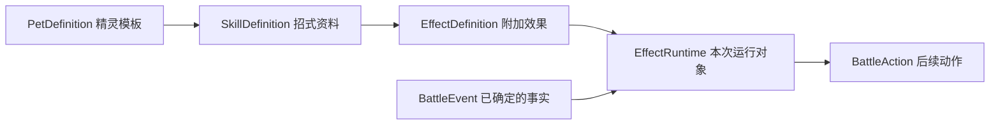

<!-- 从四个领域概念开始阅读；示例直接对应实际运行的源码，而不是另外设计一套教学接口。 -->
# 先看这四个定义

> 这是旧源码导读。新设计采用 Pet / BattlePet / Skill / Trait / Effect / Event，见 [重写草案](战斗架构重写草案.md)，待审查后实现。

先读固定资料，再读战斗过程。入口都在 `Assets/Scripts/Battle/Core`，鼠标悬停属性可看到中文说明。

| 概念 | 文件 | 它回答的问题 | 不放在这里的东西 |
|---|---|---|---|
| 精灵 | [PetDefinition.cs](../Assets/Scripts/Battle/Core/PetDefinition.cs) | 它是谁、什么属性、默认带什么招式和魂印？ | 当前 HP、剩余 PP、强化、麻痹 |
| 技能 | [SkillDefinition.cs](../Assets/Scripts/Battle/Core/SkillDefinition.cs) | 这招的威力、类别、命中、先制、PP 上限和附加效果是什么？ | 本次有没有命中、打了多少血 |
| 效果 | [EffectDefinition.cs](../Assets/Scripts/Battle/Core/EffectDefinition.cs) | 在基础出招之外，额外做什么？ | 共享配置中不能保存本次触发结果 |
| 事件 | [BattleEvent.cs](../Assets/Scripts/Battle/Core/BattleEvent.cs) | 刚刚发生了什么？ | 不直接修改 HP，也不重新计算伤害 |

这四者的关系是：精灵模板引用技能，技能挂效果；效果监听事件，再提出后续动作。



## 精灵模板和上场单位

[ClassicPets.cs](../Assets/Scripts/Battle/Content/ClassicPets.cs) 就是实际内容入口。雷伊模板引用 `ClassicSkills.Rey` 五招和 `ClassicPassives.ReySoul` 魂印。这里的技能列表是训练场默认携带配置，还不是完整的升级学习表。

开战时把模板变成 [Combatant](../Assets/Scripts/Battle/Core/Combatant.cs)：

```csharp
// 同一个雷伊模板可以被双方共用，上场 Id、生命、PP 和异常状态各自独立。
var stats = new Stats(
    level: 100, maxHp: 1000, attack: 300, defense: 230,
    specialAttack: 260, specialDefense: 220, speed: 300);
var left = new Combatant("left-rey", ClassicPets.Rey, stats);
var right = new Combatant("right-rey", ClassicPets.Rey, stats);
```

`Stats` 是已算好的实际面板，既不等于种族值，也不包含强化倍率。种族值、个体值、努力值与养成公式尚未建模；当前训练数据在 `TrainingSession.CreateBattle` 明确提供，避免混称为原版精灵种族数据。

## 从雷神天明闪看技能与效果

打开 [ClassicSkills.cs](../Assets/Scripts/Battle/Content/ClassicSkills.cs)，搜索 `ThunderFlash`：

- `power: 160` 是威力，最终伤害还要经过攻防公式。
- `maxPp: 3` 是初始上限，剩余 PP 保存在上场单位里。
- `sureHit: true` 是必中；PP 不够或麻痹仍可能不能行动。
- `DamageMultiplierEffect(chance: 1000, multiplier: 4)` 表示 **10% 概率乘四**。概率统一用万分比：10000 = 100%，5000 = 50%，500 = 5%。

`EffectEntry` 只是“条目 Id + 效果定义”。技能可挂多个条目，不要求继承出一个专用的“雷神天明闪技能类”。当前基础招式直接列出效果；需要跨集合复用时才读 `EffectSetResolver`。

[CommonEffects.cs](../Assets/Scripts/Battle/Content/CommonEffects.cs) 中的 `DamageMultiplierEffect` 分成两部分：外层保存固定的概率和倍率；内层 `Runtime` 保存这一次是否触发。每次出招都创建新 Runtime，所以上一招触发的四倍不会泄漏给下一招。默认伤害流程已经存在，普通招式不用再挂一个“造成基础伤害”的效果。

## 事件和结算草案

先看 [DamageAppliedEvent.cs](../Assets/Scripts/Battle/Core/Events/DamageAppliedEvent.cs)。它记录攻击者 Id、目标 Id、实际扣血和扣血后的 HP。假设目标只剩 10 HP，即使公式算出 100，事件里的 `Amount` 也只能是 10。

事件是事实快照，属性只有 getter。需要“让伤害乘四”时，应修改扣血前的 `DamageDraft`；扣血完成后，才发布 `DamageAppliedEvent`。

```text
计算基础伤害 → 效果修改 DamageDraft → 动作提交扣血 → DamageAppliedEvent
                                                         ↓
                                                   魂印判断 50%
                                                         ↓
                                                   动作施加麻痹
```

所以“伤害变成四倍”和“造成伤害后麻痹对方”监听的是两个不同阶段。草案放在 `BattleDrafts.cs`；具体事件放在 `Core/Events`，与草案分开。

`SourceUseId` 是**某一次出招的编号**；`SkillDefinition.Id` 是招式配置标识；`Combatant.Id` 是本场单位标识；`PetDefinition.Id` 是模板标识。它们各有用途。

## 魂印和技能效果的寿命

魂印基础类是 [PassiveDefinition.cs](../Assets/Scripts/Battle/Core/PassiveDefinition.cs)。它与技能效果共用 `EffectRuntime.Bind` 绑定接口，但创建时机不同：技能每次出招创建，出招结束解绑；魂印每局给每位拥有者创建，战斗结束解绑。

先沿着 `ClassicPets.Rey → ClassicSkills.ThunderFlash → DamageMultiplierEffect → DamageDraft` 读一遍，再沿着 `ClassicPassives.ReySoul → DamageAppliedEvent` 读一遍。执行器、宿主和监听优先级可以等理解这两个例子后再看 [完整设计](战斗系统设计.md)。

## 本轮调整

原来的 `Definitions.cs` 已按名称拆开；原来的 `BattleMessages.cs` 已拆成事件与草案。训练场实际使用精灵模板，并保留旧的临时单位构造方式供已有测试使用。所有类型仍在 `ReSeer.Battle`，没有新增程序集或修改 UI 入口。

先补 `Battle.Tests/DefinitionTests.cs`，确认缺少精灵模板时构建失败，再完成实现。64 项核心测试通过，新增覆盖模板防御性复制、重复配置拒绝、同模板两只精灵的状态隔离，以及训练场重开与无魂印变体。
