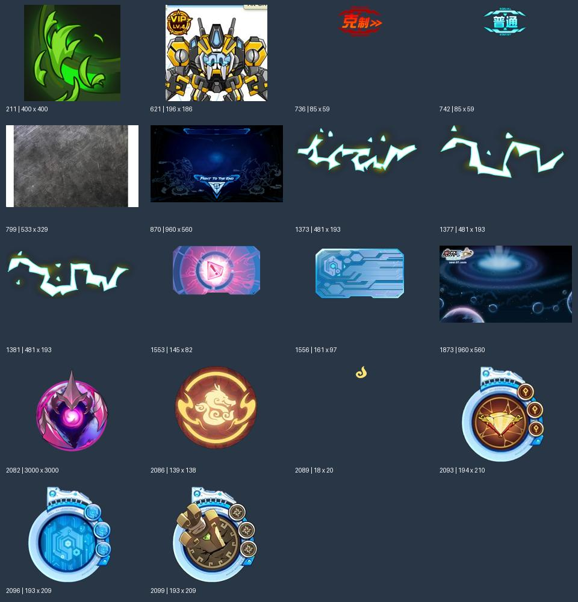
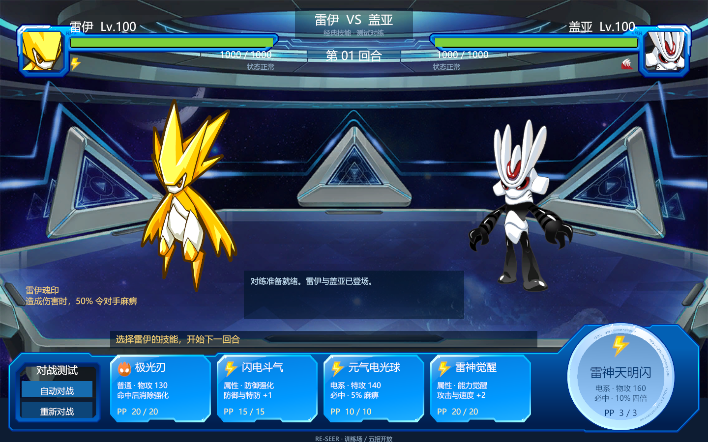

# 战斗技能／道具操作区设计建议

2026-10-01。依据用户提供的《战斗界面架构设计》对话导出和当前项目代码整理。导出文档是设计参考，其中的示例代码、指令和扩展设想不直接作为本项目的实施要求。本次只新增设计建议，不修改运行代码或场景。

## 1. 先确定三条边界

1. View 显示文字、图片、列表、禁用原因，报告点击；不扣 PP、不减少道具、不计算伤害。
2. 操作区 Controller 管技能／道具／精灵／目标页的导航和未提交的选择。完整意图才向上报告。
3. 战斗应用层接收意图，验证对局、回合、技能栏位、目标和库存；向 UI 提供确认状态和播放事件。可以先接本地战斗，未来替换成网络会话。

文档的“事件向上、方法向下”适用。但无需给每一块都加 Controller：初期 HUD 可以就是 View，消息展示可以并入表现模块。以实际职责为准。

## 2. 建议框架

```text
战斗应用层／BattleSession
    │ 确认快照、可选行动、结果事件
    ▼
BattleScreenController（整个页面协调）
    ├── BattleHudView             姓名、等级、HP、异常状态
    ├── BattleStageView           精灵站位、入场、出招和受击
    ├── BattlePresentation        按结果顺序播放、更新显示状态
    └── BattleActionController    下方操作区、未提交意图
            ├── ActionTabsView    战斗／道具／精灵／逃跑入口
            ├── SkillPanel        四个技能栏位；第五技能可独立布局
            ├── ItemPanel         战斗可用道具列表、数量、说明
            └── TargetPanel       只在确实需要时出现
```

只有 ActionController 向 ScreenController 报告 `ActionSubmitted(intent)`。切到道具页、切回技能页、悬停说明这些事留在操作区内部。HUD 不监听技能按钮；技能按钮不访问背包或网络。

ScreenController 的职责：绑定一次会话、收到输入后交给会话、协调等待与表现、退出时取消播放并解绑。伤害规则和背包过滤属于应用层，不放进 ScreenController。

## 3. 画面怎么安排

技能作为默认页，不要求每回合先点一次“技能”。官网旧指南也描述了“战斗”切到技能列表、“道具”打开道具包的入口（见下方来源）。具体复刻哪一代外观仍需以原图对照。

```text
┌──我方资料／HP────────────────对方资料／HP──┐
│                                            │
│       我方精灵              对方精灵       │
│                                            │
├──────────战斗文字／操作提示─────────────────┤
│ 四个技能，或道具列表，或换宠列表 │固定入口区│
│ 可选：独立第五技能              │战斗 道具│
│                                │精灵 逃跑│
└────────────────────────────────────────────┘
```

操作区切页只替换内容容器；入口区、上方 HUD 和战场保留。提交后保留当前内容并整体禁止操作，显示“等待结果／播放中”，便于看清自己刚选了什么。

技能卡固定四个栏位并复用现有 SkillCard／SkillButton 外观。卡片显示名称、元素、招式类别、威力、PP 和禁用状态；长说明放悬停提示。元素与招式类别分开，例如电系与属性技能不是同一个分类。

道具页只接收应用层提供的“本场战斗允许展示的道具”，不要直接把整个背包摆出来。每格显示图标、名称、数量；说明与禁用原因可显示在旁侧或提示框。初期一种固定网格／分页就够用，不必先做搜索、复杂筛选和虚拟列表。没有道具时显示空态，不能留下上一只精灵或上一场战斗的数据。

## 4. 三种状态分开保存

| 状态 | 建议字段 | 谁更新 |
|---|---|---|
| 战斗事实 | BattleId、ExpectedRound、Phase、HP、PP、库存 | 战斗应用层 |
| 菜单导航 | Skill、Item、Pet、Target；分页位置 | ActionController |
| 输入／播放进度 | 可输入、提交中、播放中、结束 | ScreenController 根据会话和播放进度协调 |

`可点击 = 应用层允许该行动 && 当前没有提交或播放 && 卡片本身可用`。

不要把导航和战斗生命周期全塞进一个枚举。尤其不能在动画结束后无条件回主菜单：必须确认仍是同一场战斗、仍是当前回合允许输入、未结束；如果要求强制换宠，应打开精灵页而不是技能页。

确认的真实状态与当前演出画面也要区分：应用层可以已收到完整回合结果，HUD 仍按事件顺序显示扣血。不要先把最终 HP 刷到 HUD，再播放先前的受击；播放结束时用最终确认快照校准即可。初期可用一条顺序播放队列，不必增加通用演出框架。

## 5. 技能与道具的实际信息流

### 点击道具入口

```text
入口 View.ItemClicked
→ ActionController 检查是否可导航
→ ItemPanel.Render(最新道具显示数据)
→ 切换当前页为 Item
```

没有战斗请求，也没有道具消耗。

### 使用当前精灵的技能

```text
SkillPanel.SkillClicked(slot)
→ ActionController 找到该栏位的可选行动
→ 默认目标唯一：补齐目标并报告完整意图
→ ScreenController 同步锁定输入
→ 会话再次校验并接受／拒绝
→ 接受：等待、播放结果、刷新 PP
→ 拒绝：展示原因，按最新状态恢复该页
```

单打技能的敌方／自身目标通常可以由规则确定，不需要每次再点精灵。以应用层提供的目标策略为准，不由技能卡猜测。

### 使用需要选目标的道具

```text
ItemPanel.ItemClicked(itemId)
→ ActionController 保存未提交的 itemId
→ 有唯一合法目标：直接补齐并提交
→ 需要选择：打开 TargetPanel(合法目标列表)
→ TargetClicked(instanceId)：补齐并提交
→ 返回：回 Item，保留页码，取消目标选择；未消耗道具
```

如果道具需要再选“恢复哪一个技能的 PP”，只为该实际需求增加技能栏位选择步骤，不先造万能多步骤表单。

`TargetId` 应是本场精灵实例编号，不能用物种 ID：队伍里可能有两只相同精灵。命令只提交意图，不携带前端声称的回血量、伤害或扣除数量。

## 6. 数据与事件契约

建议的小规模 API（职责示意，不是已实现代码）：

```csharp
// View 向操作区报告的局部点击。
event Action<int> SkillClicked;       // 技能栏位
event Action<string> ItemClicked;    // 道具 ID
event Action<string> TargetClicked;  // 战斗实例 ID

// 操作区向上报告已完成目标选择的意图。
event Action<BattleActionIntent> ActionSubmitted;

// 上级向下调用。
void Render(ActionViewData data);
void SetInputEnabled(bool enabled);
void ShowPage(ActionPage page);
```

显示数据建议：

| 数据 | 最少字段 |
|---|---|
| SkillOption | Slot、SkillId、Name、Element、Category、Power、CurrentPp、MaxPp、CanSelect、DisabledReason、目标策略 |
| ItemOption | ItemId、Name、IconKey、Count、Description、CanSelect、DisabledReason、目标策略 |
| TargetOption | InstanceId、Name、PortraitKey、HP 显示信息、CanSelect、DisabledReason |
| ActionViewData | 战斗／输入上下文、技能列表、道具列表、合法目标 |

显示模型可以组合静态配置（名字、图标、说明）与本人确认的动态状态（PP、库存、合法性）。无需额外复制整套战斗规则；“灰掉的原因”由应用层提供，点击提交时仍要再次校验。

事件用普通 C# event 即可；订阅者在明确的生命周期中配对订阅与解绑。隐藏 Panel 后数据可能变化，所以再次打开时 Render 最新数据，不仅依靠隐藏期间收到的通知。

统一 ActionSubmitted 可以保留，但用行动类型枚举或明确的请求类型；少用字符串 actionId + 任意 contentId 的组合。对网络／本地会话的转译集中在一个边界。

## 7. 当前项目能直接复用什么

| 当前文件 | 当前情况／建议 |
|---|---|
| Assets/Scripts/Battle/UI/BattleUiController.cs | 已有面板注册、导航和 ActionSubmitted，职责更接近建议的 ActionController。可在明确接线后重命名／收窄，避免再并行创建一套重复导航。 |
| Assets/Scripts/Battle/UI/State/BattleUiStateMachine.cs | 已有有限状态机；目前导航与 WaitingServer／Animating 混合。目标页 Back 直接回 Main，不支持回道具页。 |
| Assets/Scripts/Battle/UI/State/BattleUiDataState.cs | 已有血量与技能容器；ItemsChanged／PetsChanged 仅为通知，没有实际列表。适合补完整数据，不必另造全局 EventBus。 |
| Assets/Scripts/Battle/UI/SkillButton.cs | 已有显示、悬停与点击反馈。正式接线关闭 testConsumeOnClick，不通过 TryUse 在按钮中扣 PP。 |
| Assets/Scripts/Battle/UI/MainActionPanel.cs | 目前为空壳；补入口事件即可。 |
| Assets/Scripts/Battle/UI/BattleUIController1.cs | 目前为空壳；明确它是否承担页面协调，避免与现有 Controller 名称重叠。 |
| Assets/Scripts/Combat/Contracts/BattleCommand.cs | 当前只有 BattleId、Round、SkillSlot；真正使用道具前，需要应用层支持相应命令和库存结算，不能只加一个能点的 UI。 |

另需注意：BattleUiController.PresentationFinished() 当前直接尝试进入 Main，不能代表上层已允许下一次输入。ChooseEntry 接收外部传入 needsTarget 也只是骨架；正式使用时应从可选行动的数据决定目标需求。

## 8. 第一版落地顺序

1. 保留现有技能卡，完成 SkillPanel 固定栏位的 Render 与 SkillClicked(slot)，由外部刷新 PP。
2. 补操作区入口与 Skill／Item 切换，先使用测试显示数据验证导航，不提交真实道具使用。
3. 补 ItemPanel 与最小 TargetPanel，验证返回恢复、数量为零、禁用原因、数据更新。
4. 接入唯一战斗会话入口，保证双击只提交一次、拒绝可恢复、过期结果不会更新新战斗。
5. 接顺序演出，演出结束后根据最新战斗阶段决定输入页。

前四步中，第一步就能完成“技能点击→现有技能命令→确认 PP 更新”的最小闭环；道具真实使用则依赖应用层规则支持。

## 9. 已找到的 Flash 原始素材

素材源由项目清单记录为 [官方 Flash 战斗模块](https://seer.61.com/dll/PetFightDLL_201308.swf)，采集日期 2026-09-09；文件名 201308 不证明内容属于 2013 年。现成资源已经在项目中，此次未重复提取或替换。

| 用途 | 本地文件 | 提取记录 |
|---|---|---|
| 技能卡底板 | ../Assets/Art/Battle/Flash/skill-card.png | Shape 1640 |
| 技能卡悬停底板 | ../Assets/Art/Battle/Flash/skill-card-hover.png | Shape 1647 |
| 血条头像边框 | ../Assets/Art/Battle/Flash/health-frame.png | Shape 476 |
| 控制区装饰底板 | ../Assets/Art/Battle/Flash/control-panel.png | Shape 624 |
| 第五技能圆盘 | ../Assets/Art/Battle/Flash/fifth-ring.png | Shape 358 |
| 18 张原始位图及其用途 | ../Assets/Art/Battle/Flash/Extracted/README.md | CharacterId 与校验值见同目录 sources.json |

技能底板：


控制区底板：


18 张位图总览（素材总览，不是战斗截图）：



Assets/Art/Battle/OfficialUI 还包含新版 Unity 端的 battle_btnBag0、battle_btnPet、battle_btnRetreat、battle_selected_item、battle_skill_bg 等，可辅助观察功能，但不要将它们标为 Flash 原件。

## 10. 完整战斗画面的来源入口

### 官方旧版指南

[官网：基本操作／精灵对战](https://seer.61.com/main/guide/jbcz.html)。项目已缓存网页为 docs/OfficialReference/flash-guide.html，包含战斗／道具／换宠入口说明与战斗插图链接。本次网络读取该官网页面超时，图片未核验。

### 历史 Flash 实战攻略

- [7k7k：2014-06-09 新手指南](https://news.7k7k.com/content/20140609/653372.html)：找到“在战斗中，玩家可以选择技能”“如何使用药剂”“选择精灵选项”三段及对应图片。
- [4399：黑白天马势如破竹](https://news.4399.com/gonglue/seer/saiergonglue/201212-26-225724.html)：文章时间标注 2012-12-28，包含 1 月 1 日活动战斗的补充内容；不要把文章日期当每张图的拍摄日期。
- [4399：2010-09-30 巅峰之战](https://news.4399.com/seer/saiergonglue/201009-30-78274.html)：旧版本 NPC 战斗画面入口。

这些网页已查到对应战斗图片条目，但图片外链返回 403；内置浏览器核对超时。因此提供原网页入口，没有把未查看的图片声称为已验证、已下载截图。打开网页后优先对比技能默认页、道具展开页、换宠页的内容区域和固定按钮位置。

### 动态参考

[B站：赛尔号对战界面【怀旧服重置版】](https://www.bilibili.com/video/BV15aWce5EMo/)：社区重制参考，不能当成原版官方 Flash 战斗截图。

### 当前项目的完整预览

以下是已查看的本地项目画面，方便对照当前完成度。它混合 Flash 装饰和其他素材，不是官方实战截图。



