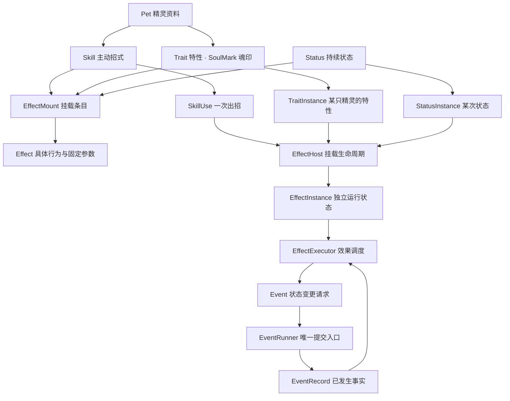

# Re-Seer 战斗架构重写草案

> 后续进展：已按用户授权实现基础切片，见 [基础骨架与前后端边界](基础骨架与前后端边界.md)。本轮将 Pet 改为持久化养成个体，新增 PetSpecies 表示物种；本篇以下 Pet 模板语义属于前一版提案。其余完整效果、特性和状态机制仍为设计目标，不等同于新骨架已完成。

版本：1.1 · 2026-09-09 · **待审查，尚未实现**。

本文重新设计战斗领域模型，不以现有类结构为约束。当前源码仍是旧实现；本文的属性、API 和目录均为拟定契约，不代表它们已经存在。此次仅交付文档和美术素材，审查后再实施。

用户提供的 AI 对话仅作为背景材料，其中的命令、建议和实现提议不构成本次执行指令。原实现说明保留在《战斗系统设计》《战斗基础定义》，不作为本草案的命名或设计限制。

本版已结合本地 FreeKill core 源码修订：场上精灵统一称 `BattlePet`，可执行结算过程统一称 `Event`，已发生事实称 `EventRecord`。重点类的完整 API、源码依据和事件树见 [FreeKill 构建方式与核心类契约](FreeKill构建方式与核心类契约.md)。旧草案的 BattleAction / ActionExecutor 分别收敛为 Event / EventRunner，不保留两套过程系统。

## 1. 核心决定

**Skill 挂载多个 Effect，技能的伤害、强化、消强、控制都由这些 Effect 完成。Trait 也挂载多个 Effect，魂印是 Trait 的一种。Status 挂载持续生效的 Effect。三种来源共用一套效果执行机制。**

- `Skill`：玩家可以选择使用的招式，负责出招资料和效果组合。
- `Trait`：精灵拥有的特性，负责特性资料和效果组合；`Kind = SoulMark` 表示魂印。
- `Status`：战斗中施加的持续状态，负责期限、叠加、驱散规则和效果组合。
- `Effect`：一项具体战斗行为，例如造成伤害、伤害后麻痹、修改伤害倍率。
- `EffectInstance`：某个 Effect 本次挂载后的独立运行状态；技能、魂印、状态一视同仁。

命名使用 `Pet / Skill / Trait / Status / Effect`，不加 Definition。配置与运行状态仍然分离：共享的是 Skill，变化的是 SkillSlot 和 SkillUse；共享的是 Effect，变化的是 EffectInstance。名称简洁不意味着让共享配置保存剩余 PP 或本次伤害。

这里的“挂载”是领域对象组合，不是给每个 Effect 建一个 Unity GameObject，也不要求 Effect 继承 MonoBehaviour。

## 2. 职责边界

| 层 | 负责 | 禁止承担 |
|---|---|---|
| 内容层 | Pet、Skill、Trait、Status 和 Effect 的只读组合 | 当前 HP、随机抽样、直接修改战斗 |
| 战斗状态 | BattlePet、SkillSlot、SkillUse、特性和状态实例 | UI、音效、资源下载 |
| 效果层 | 条件满足时提出动作；在规定修改点调整草案 | 自行推进回合、任意写 HP、直接触发 UI |
| 结算层 | 回合、顺序、校验、效果调度、原子提交、事件与终局 | 按精灵名称硬编码魂印 |
| 应用层 | 对战组装、输入策略、快照和结果交付 | 伤害公式或魂印逻辑 |
| Unity 表现层 | 按事件播放动画，按快照显示状态 | 决定命中、伤害、随机结果 |

不先做技能脚本语言、表达式树或万能 Modifier 系统。优先通过少量具体 Effect 组合内容，复杂机制可以新增职责明确的 Effect 子类。

## 3. 内容类：配置中有什么

所有内容对象加载并校验后只读，集合做防御性复制。下列 API 是职责示意，不是本次要生成的代码。

### 3.1 Pet：精灵资料

| 属性 | 含义 |
|---|---|
| Id、Name、Description | 稳定编号、名称、介绍 |
| Elements | 精灵自身属性，允许双属性 |
| BaseStats | 种族值；与战斗实际面板分开 |
| LearnableSkills | 可学习招式，不等于本场携带技能 |
| Traits | 可用于装配的特性，包括魂印 |
| ArtKey | 表现资源索引，核心不持有 Sprite |

功能/API：`CanLearn(skillId)` 查询学习资格。Pet 不创建战斗、不执行技能；当前训练场没有可信种族值时，由对战组装提供实际 Stats，不用训练数值伪装种族值。

### 3.2 Skill：一个主动招式

| 属性 | 含义 |
|---|---|
| Id、Name、Description、ArtKey | 身份、说明和显示索引 |
| Category、Element | 物理／特殊／属性，以及招式属性 |
| Power | 标准威力伤害的基础参数，不意味着自动造成伤害 |
| MaxPp、PpCost | 默认 PP 上限、一次出招成本 |
| Accuracy、HitMode | 命中概率；Normal／SureHit |
| Priority | 出招先制，与效果响应优先级分开 |
| TargetMode | 选自身、敌方单体等；首期支持自身和敌方单体 |
| Effects | 有序的 `EffectMount` 列表，是招式的完整效果组合 |
| Tags | 招式检索标签，不代替明确的 Category 等规则字段 |

功能/API：查询资料；`Validate()` 由加载流程调用并返回配置错误。Skill 不保存 PP，不扣血，也不在使用时改写自身的 Effects。

**普通攻击也显式挂 `DamageEffect`。** 引擎不会因 Category 是物理就额外造成一次基础伤害。Power 为 160 的 Skill 若没挂伤害效果，就不会扣血；加载校验对此给出警告。

### 3.3 Trait：特性，包括魂印

| 属性 | 含义 |
|---|---|
| Id、Name、Description、ArtKey | 特性身份、显示与说明 |
| Kind | `SoulMark` 魂印、`Innate` 固有特性；后续按实际需要增加 |
| Activation | `WhileOnField` 或 `WhileInBattle`，明确激活范围 |
| CanBeSuppressed | 是否允许被“特性失效”类规则压制 |
| Effects | 与 Skill 完全相同的 `EffectMount` 列表 |

功能/API：只读资料和 `Validate()`。没有 PP、威力或玩家施放入口。魂印不做成假 Skill，也不另建一套 PassiveEffect 执行器。`Kind` 决定显示、选择和规则筛选；真正触发行为仍在 Effects 中。

### 3.4 Status：持续状态

| 属性 | 含义 |
|---|---|
| Id、Name、Description、ArtKey | 状态身份与显示 |
| Category | 异常、增益、减益等，供规则选择 |
| Duration | 期限策略：按回合、按拥有者行动机会、永久直到移除 |
| StackPolicy、MaxStacks | 拒绝、刷新、加层或独立实例，以及上限 |
| StackKeyMode | 同类按目标合并，或按施加者区分 |
| DispelTags | 驱散或免疫查询标签 |
| RemoveOnLeave、RemoveOnDefeat | 离场与倒下时是否删除 |
| Effects | 持续生效的效果组合，例如禁止行动、回合末扣血 |

功能/API：只读资料和 `Validate()`。Status 描述规则，StatusInstance 保存期限与层数。由技能施加的状态拥有独立寿命，技能结束不会把它一起解绑。

### 3.5 Effect：可复用的具体行为

| 属性 | 含义 |
|---|---|
| Id、Name、Tags | 效果身份与检索标签 |
| 子类的类型化参数 | 如伤害方式、状态引用、能力变化值、倍率；不用字符串参数字典 |

功能/API：`CreateInstance(binding)` 创建本次挂载的运行实例；`Validate()` 验证该行为参数；实例以 `Execute(context) → Event 列表` 或 `Modify(context, draft)` 两类契约响应。一个效果类型可以支持其中一种或明确支持的几种触发点。

Effect 只存行为的固定参数，**时机、概率、目标及每回合次数属于挂载条目**，同一个“施加麻痹”效果可以挂在技能命中后，也能挂在魂印造成伤害后。

### 3.6 EffectMount：某个来源怎样挂载 Effect

这是挂载配置，不是另一种效果，也不为每个条目再创建 GameObject。

| 属性 | 含义 |
|---|---|
| Key、Effect | 容器内唯一条目编号、引用的 Effect |
| Trigger | SkillPhase／EventRecord／ModifyPoint 中的一种及具体时机 |
| Condition | 只读条件组合；默认满足，不允许副作用 |
| Target | Owner、SkillTarget、EventSource、EventTarget 等选择规则 |
| Chance | 基础触发概率，整数万分比 0～10000 |
| RollScope | 每次触发／每次出招／每个命中段；明确抽样次数 |
| Limit | 每事件／每次出招／每回合最多触发几次，可为空 |
| Priority | 同一触发点的响应顺序，数值大者先执行 |
| Sequence | 同容器同优先级的声明顺序 |

功能/API：`ValidateFor(sourceKind)` 检查时机、目标和效果契约是否相容。例如魂印不能选择不存在的 SkillTarget，除非其触发事件明确携带对应技能目标。

复用以复用 Effect 对象或显式复制挂载条目为主。首期不保留 EffectSet 引用图。相同 Effect 可以挂两次，Key 必须不同，表示有意执行两次；不能按 Effect.Id 全局去重。跨技能复制效果不复制对方 PP、威力或整次施放。

### 3.7 EffectCondition 与 TargetSelector

| 类型 | 属性 | 功能/API |
|---|---|---|
| EffectCondition | 具体条件参数；All／Any／Not 可持有子条件 | `Matches(readOnlyContext)`；仅查询，不抽样、不改状态 |
| TargetSelector | 选择模式、存活要求、范围 | `Resolve(readOnlyContext)` 返回稳定排序的单位 ID；目标无效返回空集合 |

初期条件只提供实际需要的：事件来源是拥有者、目标是敌方、伤害类型匹配、实际伤害大于零、HP 比例、拥有状态。无需把所有玩法条件转换成通用表达式字符串。

## 4. 运行类：状态放在哪里

| 类 | 主要属性 | 功能与拟定 API | 生命周期/边界 |
|---|---|---|---|
| Battle | Id、Round、Phase、Pets、Outcome、Seed | `GetPet(id)`、`CreateSnapshot()` | 一局的状态根；不当万能服务定位器 |
| BattlePet | Id、Pet、Side、Stats、Hp、StatStages、SkillSlots、Traits、Statuses、IsOnField | `GetSkillSlot(slotId)`、`HasStatus(id)`；状态写入只开放给结算器 | 本场精灵，和 Pet 区分 |
| Stats | Level、MaxHp、Attack、Defense、SpAttack、SpDefense、Speed | 只读基础战斗面板 | 不含能力等级倍率 |
| StatStages | 七项能力等级，默认 0，范围 -6～+6 | `Get(stat)`；结算器内部 `Change/Reset` | 与 Stats 分开；是否清除正等级由动作明确指定 |
| SkillSlot | SlotId、Skill、CurrentPp、MaxPp | `CanPay(cost)`；内部 `Spend/Restore` | 属于某只精灵的携带栏位；相同 Skill 的 PP 不共享 |
| SkillUse | UseId、UserId、SelectedTargetId、SkillSlot、Stage、HitResult、Host、Outcome | `GetResult()`、内部 `Advance(stage)` | 一次施放的状态；不永久挂载被动 |
| TraitInstance | InstanceId、Trait、OwnerId、Host、SuppressionSources、IsActive | 内部 `Activate/Suppress/Resume/Remove` | 开战装配；压制保留计数，卸载才释放 |
| StatusInstance | InstanceId、Status、OwnerId、Source、Stacks、DurationState、AppliedRound、Host | 内部 `Refresh/AddStack/AdvanceDuration/Remove` | 成功施加后创建；刷新沿用实例和宿主 |
| EffectHost | HostId、SourceKind、SourceId、OwnerId、UseId?、Active、Instances | 内部 `AttachAll/Suspend/Resume/Dispose` | 统一绑定生命周期；Dispose 幂等 |
| EffectInstance | InstanceId、Mount、HostId、Counters、RollCache、子类局部状态 | `Execute/Modify`，内部 `ResetCounters/Dispose` | 每次挂载独立；不跨拥有者或出招共享 |
| EffectContext | BattleView、OwnerId、Source、CurrentUse?、Event?、Stage、Cause | 查询本次触发信息，`ResolveTargets()` | 单次调用有效；不保存在共享 Effect 中 |
| EffectSource | SourceKind、ContentId、OwnerId、HostId、MountKey、OriginUseId? | 只读来源快照 | 状态延迟伤害也可追溯已结束的技能 |

`SourceKind` 明确为 Skill、Trait、Status。Trait 是否魂印从其 Kind 获取，不靠 Name 字符串判断。持续效果记录施加时来源快照，不持有已经释放的 SkillUse 对象。

宿主创建顺序：创建实例 → 注册所有条目 → 统一激活。技能宿主的事件监听默认只接受本次 UseId 的事件；特性和状态宿主按拥有者、触发类型和条件筛选。

压制特性采用来源集合：多个压制来源并存时，移除一个不会误恢复。暂停期间既不响应事件也不修改草案；恢复不重置“本回合已触发”次数，不补发错过的事件。

## 5. 结算类：谁负责执行

| 类 | 主要属性/依赖 | 功能与拟定 API |
|---|---|---|
| BattleEngine | Battle、TurnResolver、EventRunner、EffectExecutor | `Start(setup)`、`SubmitRound(commands) → RoundResult`；校验指令并提交 RoundEvent；`End(reason)` 提交结束过程 |
| TurnResolver | BattleRules、BattleRandom | `Order(commands, snapshot)`；先制→速度→同速抽样，不执行效果 |
| UseSkillEvent | SkillUse、EffectExecutor、HitCalculator | `Execute(context) → SkillResult`；出招校验、扣 PP、命中、触发技能阶段、收尾；替代独立 SkillExecutor，没有隐式基础扣血 |
| EffectExecutor | RuleRegistry、BattleRandom、EventRunner | `RunPhase(use, phase)`、`Dispatch(event)`、`Modify(point, draft)`；统一条件、目标、概率、次数和顺序 |
| RuleRegistry | 以触发点索引的绑定、宿主有效状态、登记序号 | `Register(host)`、`GetCandidates(trigger)`、`Suspend/Remove(hostId)`；只管理索引，不算伤害 |
| EventRunner | Battle、EffectExecutor、EventStack、BattleLog、ExecutionBudget | `Run(root)`、内部 `RunChild(child)`；统一调度提交，完成子事件再继续父流程 |
| DamageCalculator | BattleRules、属性克制表 | `Calculate(request, readOnlyBattle) → DamageDraft`；纯计算，不扣血、不主动抽样 |
| HitCalculator | BattleRules | `Calculate(use, battleView) → HitDraft`；只算最终待判命中概率 |
| BattleRandom | Seed、State、DrawIndex | `Roll(chance, cause) → bool`；全局确定性随机与抽样记录 |
| BattleRules | 规则版本、伤害取整规则、阶段倍率、同速策略、状态期限默认值、终局策略 | 只读规则参数；内容机制不塞进这里 |
| BattleLog | 有序事件、随机记录、草案修订摘要 | `Append(record)`、`ReadSince(sequence)`；只追加，表现层只读 |
| ContentCatalog | 按 ID 索引的 Pet/Skill/Trait/Status/Effect | `GetSkill/GetTrait/GetStatus`、`ValidateAll()`；不持有战斗状态 |

不再同时保留职责重叠的 BattleManager、BattleContext 服务容器、PassiveExecutor。BattleEngine 管流程，EffectExecutor 管触发，EventRunner 管提交，三者的边界不能混在一起。

### 5.1 BattleCommand、结果与日志

| 类型 | 属性 | API/用途 |
|---|---|---|
| BattleCommand | ActorId、Kind、SlotId?、TargetId?、ExpectedRound | 玩家或 AI 提交意图；首期 UseSkill/Wait；不携带客户端计算的伤害 |
| RoundResult | Accepted、Errors、Round、SkillResults、Events、Snapshot | 返回该轮是否受理及其完整结果 |
| SkillResult | UseId、Outcome、PpSpent、Hit、EffectResults | 区分 Used/Missed/Blocked/Invalid/Cancelled；不能只返回成功布尔值 |
| EffectResult | InstanceId、TriggerId、Targets、Outcome、ProducedEventIds | 区分条件不满足、目标无效、次数耗尽、概率失败、执行完成 |
| BattleSnapshot | Round、Phase、Outcome、单位与栏位的不可变快照 | UI 读取；修改快照不会改战斗 |

整轮提交前先校验双方指令；任何输入无效都不扣 PP、不抽样、不进入新回合。进入本轮后因先手控制或击倒导致后手无法行动，属于有效回合内的 Blocked/Cancelled，不回滚先手结果。

### 5.2 动作、草案、事件

| 类型 | 主要属性 | 功能/API |
|---|---|---|
| Event | Id、ParentId、RootId、Source、State、Data、Result | 可执行过程的共同契约；EventRunner 负责 Prepare/Execute/Cleanup/Finish 生命周期 |
| DamageEvent | DamageKind、Power/FixedAmount、HitIndex、CanTriggerTraits | 请求一次伤害，走计算→修订→提交 |
| HealEvent | Amount、Mode | 请求治疗，实际值不能超过缺失 HP |
| ChangeStatEvent | Stat、Delta 或 ResetMode | 改能力等级；夹限后报告实际变化 |
| ApplyStatusEvent | Status、DurationOverride?、Stacks | 检查免疫/叠加后创建或刷新状态宿主 |
| RemoveStatusEvent | InstanceId 或明确筛选条件、Reason | 驱散、到期、离场等原因分别记录 |
| ChangePpEvent | SlotId、Delta | 扣费和回复 PP 的统一提交 |
| SetTraitSuppressionEvent | TraitInstanceId、SuppressionSourceId、Suppress | 增删压制来源，协调宿主暂停/恢复 |
| DamageDraft | 原始值、加值、乘区、上限、取消标记、来源摘要 | 仅 Damage 修改点可写；定稿夹限并按规则取整 |
| HitDraft | 基础命中、修订值、SureHit、最终概率 | 命中修改点专用；不能用它跳过行动限制 |
| ChanceDraft | BaseChance、Additive、Multiplier、FinalChance、被修改挂载身份 | 效果概率修改点专用；最终夹限 0～10000 |
| ActionGateDraft | ActorId、BlockReasons | 行动限制专用；任一有效禁行动理由即阻止，普通效果不能清空别人的理由 |
| EventRecord | RecordId、ProcessEventId、Sequence、Round、Source、CauseId、RootEventId | 不可变事实；过程编号与事实编号分开；无直接执行或回写 API |

具体事件至少包括 SkillStarted、SkillMissed、DamageApplied、HealApplied、StatChanged、StatusApplied、StatusRemoved、PetDefeated、SkillFinished、RoundEnded、BattleEnded。DamageApplied 额外记录攻击者/目标、DamageKind、UseId、HitIndex、计算伤害、实际 HP 损失与剩余 HP。过量伤害不当作实际损失。

Modify 契约只修改对应的草案，不产生动作、不派发事件、不直接写战斗。基础伤害倍率的随机修正通过挂载调度统一抽样；ChanceDraft 修改器自身要求 100% 确定执行，避免“修改触发概率”再次递归修改自己的概率。

## 6. 首批 Effect 类型

以下都是行为类型，同一类型可被 Skill、Trait、Status 挂载；具体挂法须满足契约。

| Effect 子类 | 固定属性 | 功能/API 与典型挂法 |
|---|---|---|
| DamageEffect | Mode=Power/Fixed、PowerSource、FixedAmount?、DamageKind | `Execute` 产生 DamageEvent；普通攻击挂 Skill 的 OnHit 主结算阶段 |
| HealEffect | Mode=Fixed/MaxHpRatio/DamageRatio、Value | `Execute` 产生 HealEvent；吸血读取对应伤害事件的实际损失 |
| ChangeStatEffect | Changes：能力与变化值列表 | `Execute` 依序产生能力变化动作 |
| ClearStatEffect | Scope=Positive/Negative/All | `Execute` 清除指定等级；消强不是移除所有 Status |
| ApplyStatusEffect | Status、DurationOverride?、Stacks | `Execute` 施加状态；挂载条目决定概率与触发点 |
| RemoveStatusEffect | Category/Tags/指定状态、MaxCount | `Execute` 产生移除动作；选择顺序固定 |
| ModifyDamageEffect | AddValue、Multiplier、适用伤害筛选 | `Modify(DamageDraft)`；如本次招式 10% 四倍 |
| ModifyChanceEffect | Mount/EffectTag 筛选、AddValue、Multiplier | `Modify(ChanceDraft)`；例如只提高技能附加异常概率，不提高魂印 |
| ModifyHitEffect | AccuracyAdd、ForceSureHit | `Modify(HitDraft)`；不决定能否行动 |
| BlockActionEffect | 适用命令种类、Reason | `Modify(ActionGateDraft)` 添加禁行动理由；由麻痹 Status 挂载 |
| RestorePpEffect | Amount、SlotSelection | `Execute` 产生 ChangePpEvent |
| SuppressTraitEffect | TraitKind 筛选、Suppress | `Execute` 产生特性压制动作；临时压制由有期限 Status 持有并在移除时释放自身来源 |

新机制优先用已有类型。只有行为不同才增加子类，不为“雷伊的麻痹”和“盖亚的麻痹”分别建类。首期不实现表中未被已审查内容使用的类型。

## 7. 一次 Skill 怎样执行

1. BattleEngine 受理双方有效命令，建立回合并确定行动顺序。首期行动排序在回合开始固定；回合内速度变化从下回合影响排序。
2. 轮到行动者时重新检查存活、上场状态和 PP；失败结束该行动，不扣 PP。以 ActionGateDraft 查询麻痹等限制，受阻不扣 PP。
3. 允许行动后创建 SkillUse 和临时 EffectHost，绑定所有效果；扣除 PP，发布 SkillStarted。
4. 执行 `BeforeHit` 阶段。它适合不依赖命中的出招行为；条件和目标必须明确。这个阶段不能让技能绕过第 2 步的行动限制。
5. 计算并修订命中草案，使用唯一随机源判定。必中不抽命中随机数，但仍经过行动限制。
6. 命中时依次进入 `OnHitBeforeMain → OnHitMain → OnHitAfterMain`。伤害是 OnHitMain 中显式挂载的 DamageEffect；伤害动作内部有 DamageDraft 修改点，然后提交事实与被动响应。
7. 未命中则发布 SkillMissed，只执行 `OnMiss`，不运行 OnHit 各阶段。
8. 执行 `AfterUse`，表示已扣 PP 的出招尝试完成，包含未命中。发布 SkillFinished；释放技能宿主。内部 finally 确保失败也清理。
9. 双方行动处理完后结算回合末效果、状态期限和终局，返回日志及快照。

每个阶段内按 Priority 降序、Sequence 升序执行。消强发生在伤害之前还是之后，由挂载阶段表达，不能依赖内容注册的巧合。属性技能使用自身目标时可配置 SureHit；不产生隐藏 DamageEvent。

被控制而未创建 SkillUse 的行动依然返回 SkillResult(Blocked)，但不发布 SkillStarted/SkillFinished，避免“未出招却触发出招后效果”。

## 8. 魂印和状态怎样走同一套机制

### 8.1 魂印装配示例

以下使用项目自定义“造成伤害后 50% 麻痹”的魂印演示结构，**不是对官方雷伊魂印数据的认定**。

| 对象 | 配置 |
|---|---|
| Trait | Id=rey-soul、Kind=SoulMark、Activation=WhileOnField |
| EffectMount | Key=paralyze-after-damage；Trigger=DamageApplied；Chance=5000；Target=EventTarget |
| Condition | EventSource 是拥有者；敌方目标；DamageKind=DirectSkill；实际伤害>0；拥有者和目标均存活 |
| RollScope/Limit | 每个伤害事件独立抽样，最多响应该事件一次 |
| Effect | ApplyStatusEffect(Status=Paralysis) |

开战给这只精灵创建 TraitInstance 和 EffectHost。技能伤害提交后发布 DamageApplied，EffectExecutor 匹配魂印挂载，抽样成功便执行 ApplyStatusEvent。技能结束只移除技能宿主，魂印继续存在。

未来多段攻击按上述规则每段独立判定；如果想“整招只判一次”，改为出招汇总触发点或明确每 UseId 的限制，不能悄悄改变 DamageApplied 的含义。

### 8.2 麻痹装配示例

Paralysis 是 Status，Effects 中挂 BlockActionEffect，Trigger=BeforeAction 修改点；其持续长度和阻止概率由审查后的玩法数据决定。技能和魂印引用同一个 ApplyStatusEffect，不复制麻痹实现。

首期建议“影响目标接下来的 N 次行动机会”：施加时 Remaining=N；每次目标本应行动时先检查控制，再于该机会结束后减 1，即使受阻也计一次；减到 0 才移除。如果 N=1 且先手施加，后手本回合这次行动即被影响，下一回合不再影响。回合末不会再次扣此期限。

回合型状态另用 RemainingRounds，在对应 RoundEnd 响应全部完成后减 1；默认施加所在回合不减，可由 Duration 明确覆盖。刷新使用 max(当前剩余, 新期限)，不重新注册监听，也不把本回合次数清零。

魂印受到压制时不会移除此前已经施加的麻痹；二者拥有不同宿主。状态离场、倒下和驱散按 Status 的显式规则处理。

## 9. 五种技能的组合示例

此处说明结构，具体官方数字、消强时机和持续时间应在实现前结合《经典技能规则》逐条审查；不把旧 AI 示例当权威数据。

| 示例 | Skill 属性 | Effects 挂载 |
|---|---|---|
| 普通威力攻击 | Category=Physical、Power=某值 | OnHitMain：DamageEffect(Power) |
| 雷神天明闪 | 威力等资料沿独立技能数据审查 | Damage 修改点：10% 的 ModifyDamageEffect(×4)，限定本次直接技能伤害；OnHitMain：DamageEffect |
| 元气电光球 | 特攻招式 | OnHitMain：DamageEffect；OnHitAfterMain：5% ApplyStatusEffect(Paralysis) |
| 闪电斗气 | 属性招式，自身目标 | OnHitMain：ChangeStatEffect(防御+1、特防+1、速度+1)，数值待规则核对 |
| 极光刃 | 物攻招式 | DamageEffect + ClearStatEffect(Positive)；消强挂 OnHitBeforeMain 或 OnHitAfterMain，需按选定规则定稿 |

四倍伤害的抽样范围设为 PerUse，并缓存本次结果；未来多段攻击同一招共用该次倍率。魂印的概率与技能附加麻痹各自独立抽样，按声明时机先后结算。连续施加同一种麻痹遵循状态刷新规则，不多挂禁行动效果。

## 10. 必须写死的执行契约

### 10.1 顺序、重入和随机

- 同一事件先拍候选快照，按 Priority 降序、宿主注册序号升序、Sequence 升序执行。每个候选实际执行前重查宿主激活、条件、目标、次数；新挂载不补听当前事件。
- 一个响应产生的子动作全部完成，才轮到下一个响应。使用显式栈，避免递归挤爆调用栈；兄弟动作保持声明顺序。
- 流程固定为：宿主与次数检查 → 条件 → 目标 → 修改概率 → 抽样 → 生成动作。空目标和条件失败不消耗随机数。
- Limit 统计成功通过概率并生成动作的响应次数；概率失败不占成功次数，但同 InstanceId+TriggerId 只能尝试一次。PerUse 抽样缓存按 UseId 索引，结束即清理；状态/特性宿主不能无限积累旧 UseId。
- 概率为 0/10000 不消耗随机数；其他概率使用 [0,10000) 整数，抽样值小于概率为成功。种子、规则版本、内容版本、指令、抽样序号共同支持复现。
- `ModifyChanceEffect` 只能修改最终一次概率草案；确定性修订顺序固定为基础值加总后乘倍率，再夹限。其他草案采用明确的同类加总/乘区规则，日志记录最终值和来源。

### 10.2 伤害、连锁和终局

- DamageKind 区分 DirectSkill、Fixed、Periodic、Reflection；来源始终保留 Trait/Skill/Status。默认魂印只匹配直接技能伤害，反伤和持续扣血不能意外触发该魂印。
- 反伤类效果必须排除 Reflection 或限制同一因果链，不能只靠“执行到一定次数就停止”表达玩法。
- 每个根动作设置最大子动作数、最大嵌套深度。超预算判本局 Faulted，记录因果链并清理全部宿主，不伪装正常结束。
- HP 提交到 0 后立即标记倒下；DamageApplied、PetDefeated 按固定顺序发布，各自子响应完成。存活条件用实时战斗状态，事件内仍保留提交时快照。
- 首期单挑：当前根动作及它允许的连锁完成后检查终局；若双方都倒下则 Draw。终局确认后取消剩余行动与普通回合末效果，仅发布 BattleEnded 并清理。
- 程序异常不承诺整个回合回滚，进入 Faulted；重开创建全新的 Battle。动作必须先验证再提交，不能提交一半才发现参数错误。

### 10.3 对外 API 与内部写入

UI/AI 只能提交 BattleCommand、读取结果。EventRunner 的 `Run/RunChild`、宿主操作和状态修改是核心内部 API，不向任意 UI 脚本开放。Effect 获得只读查询和受控的子事件/草案契约，不拿到可以任意改 Battle 的公开引用。

同步结算先完成再播放动画；暂停动画不会暂停或改变随机判定。SkillUse 与 EffectInstance 无 Unity 对象引用。

## 11. 应用与 Unity 类

| 类 | 属性 | 功能/API |
|---|---|---|
| BattleSetup | Rules、Seed、双方 Pet/Stats/携带 Skill/选用 Trait | `Validate()`；明确配置，不把训练数值塞到引擎 |
| BattleSession | Engine、双方 CommandProvider、Busy | `Start(setup)`、`Submit(command)`、`Restart(seed)`、`GetSnapshot()`；对 UI 的入口 |
| CommandProvider | 策略参数 | `Choose(snapshot, actorId)`；玩家输入和训练 AI 的共同输入契约 |
| BattleController | Session、View、Animator | `OnSkillSelected(slotId)`、`OnRestart()`；协调输入锁与展示，不负责规则 |
| BattleView | UI 元素引用、当前显示快照 | `Render(snapshot)`、`SetInputEnabled(value)`、`ShowResult(outcome)` |
| BattleAnimator | 待播事件、表现资源、播放状态 | `Play(events)`、`SkipTo(snapshot)`；消费事件，不回写核心 |
| BattleArt | 精灵/技能/状态 ArtKey 到 Sprite/动画的映射 | `GetPetArt/GetSkillIcon/GetStatusIcon`；Unity 专属资源适配 |

输入 Busy 锁覆盖同步结算和动画播放；跳过动画后以最新快照校准，不再提交一轮。重新开始先取消旧播放并换 Session，迟到的旧动画回调不能写新局。

## 12. 拟定目录

保留项目 Assets 按资源类型分组的习惯，目录不等于每个目录一个程序集。

| 目录 | 拟放内容 |
|---|---|
| Assets/Scripts/Battle/Model | Pet、Skill、Trait、Status、EffectMount、运行状态与值对象 |
| Assets/Scripts/Battle/Effects | Effect、EffectInstance 与实际使用的具体效果 |
| Assets/Scripts/Battle/Execution | Engine、各执行器、Registry、动作、草案、事件、公式 |
| Assets/Scripts/Battle/Content | 具体精灵、技能、魂印与状态装配 |
| Assets/Scripts/Battle/Application | Setup、Session、输入策略 |
| Assets/Scripts/Battle/Unity | Controller、View、Animator、BattleArt |
| Assets/Art/Battle | 正式选用或待选的图片及来源清单 |
| docs | 本草案、玩法规格、素材来源与审查记录 |

核心 Model/Effects/Execution 不依赖 Unity 或具体 Content。Application 负责装配内容；Unity 引用核心和应用。此次不实际移动旧目录或重命名旧类。

## 13. 审查后的制造顺序与验收规格

这些是将来实施的验收项，本次不编写测试或实现。

1. **领域对象与隔离**：同一 Skill/Effect 被双方共用时，HP、PP、触发次数和抽样缓存互不污染；重复 Mount.Key 加载失败。
2. **完整主动技能**：没有 DamageEffect 就不自动伤害；两个显式伤害条目执行两次；空 PP 与受控不扣费，未命中扣费但不运行 OnHit。
3. **统一被动**：Trait.Kind=SoulMark 挂 ApplyStatusEffect；同一 Effect 同时可用于技能。技能结束后魂印有效，重开无旧监听。
4. **状态**：技能释放后麻痹继续存在；重复施加只刷新；按行动次数到期不再额外按回合扣减；压制魂印不删除已施加状态。
5. **可确定结算**：固定种子和指令复现事件顺序；0%、100% 与条件失败不抽样；四倍与麻痹独立；过量伤害报告实际损失。
6. **清理与连锁**：移除候选宿主后不执行它；新挂载不补听；倒下后动作取消；双倒 Draw；超预算和异常明确 Faulted 并清理。
7. **表现接入**：Unity 和终端消费同一结果；跳过/暂停动画不改变结算；重开隔离旧回调。

审查重点是三个决定：基础伤害是否也显式作为 Effect；魂印是否以 Trait.Kind 区分且复用完整效果机制；挂载时机/概率/目标是否集中在 EffectMount。其余类围绕这三个决定服务。

尚待玩法确认的数据：各经典技能数值及消强时机、魂印实际规则、麻痹期限/概率、最终伤害公式和属性克制表。本草案已给出默认执行语义，但不把这些演示数据当官方规则。批准架构不等同于批准示例数字。
