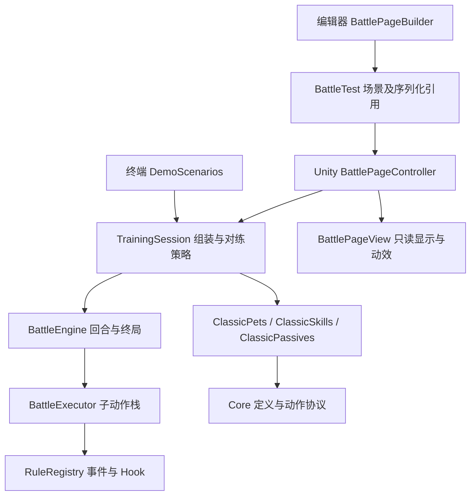

<!-- 项目设计说明：历史材料作为讨论依据，当前需求与本文件的实施边界优先。 -->
# Re-Seer 战斗系统设计

> 本文保留描述旧实现。新架构审查请看 [战斗架构重写草案](战斗架构重写草案.md) 和 [FreeKill 核心类契约](FreeKill构建方式与核心类契约.md)；新方案尚未修改源码。

版本：0.3，2026-09-09。终端与 Unity 2022.3 共用同一份纯 C# 战斗逻辑。雷伊的五招与用户指定魂印通过事件系统结算；界面仅提交指令并显示结果。

## 从哪里开始读

第一次阅读请先看 [战斗基础定义](战斗基础定义.md)：`PetDefinition → SkillDefinition → EffectDefinition → BattleEvent`。实际内容从 `Content/ClassicPets.cs` 进入。以下是理解基础概念之后的运行流程。

打开 `Assets/Scenes/BattleTest.unity` 后运行即可对练。场景已保存摄像机、Canvas、EventSystem、五个技能按钮和组件引用，不需要手动拖拽依赖。编辑器菜单 `Tools → Re-Seer → 创建测试战斗页` 可重新生成该场景；重建会覆盖测试场景的手工布局，构建器发现未保存的场景时会停止。

建议按以下顺序阅读，每一步回答一个明确的问题：

| 顺序 | 入口文件 | 负责回答的问题 |
|---|---|---|
| 1 | `Assets/Scripts/Battle/Unity/BattlePageController.cs` | 用户点击如何成为指令？如何锁定重复输入、自动对战和重开？ |
| 2 | `Assets/Scripts/Battle/Application/TrainingSession.cs` | 双方是谁、技能和魂印如何装配、盖亚如何选招？ |
| 3 | `Assets/Scripts/Battle/Core/BattleEngine.cs` | 如何验证整回合指令、决定行动顺序、判断终局？ |
| 4 | `Assets/Scripts/Battle/Core/SkillUse.cs` | 一次技能怎样创建作用域、扣 PP、判命中、伤害并收尾？ |
| 5 | `Assets/Scripts/Battle/Core/BattleExecutor.cs` | 事件响应产生的子动作怎样完整结算后再返回父流程？ |
| 6 | `Assets/Scripts/Battle/Core/RuleRegistry.cs` | 哪些监听器能响应、顺序如何确定、何时解绑？ |
| 7 | `Assets/Scripts/Battle/Content/ClassicSkills.cs`、`ClassicPassives.cs` | 内容配置如何组合现有效果？魂印怎样监听伤害？ |

## 入口与依赖方向

编译边界固定为三个程序集：`ReSeer.Battle` 包含 Core、Content、Application，设置 `noEngineReferences: true`，编译器禁止它引用 Unity；`ReSeer.Battle.Unity` 只引用核心与 uGUI；`ReSeer.Battle.Editor` 只在编辑器编译，负责装配场景。PlayMode 测试有独立测试程序集，不进入正常游戏构建。`.asmdef` 是不支持注释的 JSON，中文职责说明集中记录在这里。

Core 不引用 Content；两者处于同一程序集，让受限的状态写入与随机入口保持 `internal`。目前不为每个目录增加程序集。终端的 `Battle.Core.csproj` 显式链接 `Assets/Scripts/Battle` 下的 Core、Content、Application 三个目录；同模块下的 Unity 适配、Editor、Tests 不进入终端编译。

## 项目目录与程序集边界

Assets 顶层按资源类型分为 `Scripts`、`Art`、`Scenes`。业务模块在 Scripts 内组织，当前战斗源码全部位于 `Assets/Scripts/Battle`。美术位于 `Assets/Art/Battle`，后续角色、场景、特效等素材可以继续在 Art 下分类。场景保存 Sprite 引用，当前没有动态按路径加载的需求，因此不使用 Resources 目录。

目录负责让人找到文件，`.asmdef` 负责限定编译依赖。`ReSeer.Battle.asmdef` 位于 Battle 根目录，`Unity/ReSeer.Battle.Unity.asmdef` 划出嵌套的 Unity 适配程序集，Editor 和 Tests 再分别划出各自程序集；因此源码集中管理仍能保持核心无 Unity 依赖。移动目录不更改程序集名称、命名空间或资源 GUID。

## 一次点击到一次魂印触发

1. `BattlePageController.Awake` 使用场景保存的 `view` 引用绑定按钮，并创建 `TrainingSession(seed)`。不扫描场景寻找依赖。
2. `TrainingSession.CreateBattle` 从 `ClassicPets` 共享模板创建新的雷伊、盖亚上场状态，并注入面板与随机源；雷伊持有只读 `ClassicPassives.ReySoul` 定义。`BattleEngine` 为每位被动拥有者创建独立 Runtime 与全局宿主。
3. 点击技能后，控制器设置 Busy，调用 `TrainingSession.Submit(skillId)`；盖亚策略产生对方指令，再进入 `PlayRound`。双方指令先验证，随后按先制、速度、同速随机排序。
4. `UseSkillAction` 创建本次 `SkillUse` 和限定 UseId 的技能宿主，先绑定全部效果，再检查麻痹、存活和 PP。成功后扣费，发出开始事件，判命中，提交标准伤害。
5. `DamageAction` 写入实际 HP 损失，发布含攻击者、目标、实际伤害和剩余 HP 的 `DamageAppliedEvent`。雷伊魂印匹配“自己伤害对手、实际伤害大于零、双方仍存活”，进行一次独立的 `ChanceKind.Passive` 50% 判定。
6. 成功后记录魂印战报，产生 `ApplyStatusAction`，创建或刷新麻痹。执行器先完成这个子动作，再继续技能的 `AfterSkillCoreEvent`；因此元气电光球的 5% 麻痹在魂印之后独立判定。重复麻痹刷新同一状态的期限，不叠加两个禁行动监听器。
7. 技能完成后释放技能宿主，魂印和仍有效的麻痹宿主保留。回合末推进期限；终局清空规则。界面读取 Trace 和当前状态，播放位移动效与血条过渡；动画时长不影响战斗数值。

## 三种生命周期

| 对象 | 创建时机 | 匹配范围 | 清理时机 |
|---|---|---|---|
| 技能 Runtime / Host | 每次出招 | 本次 SourceUseId | 本次技能结束，异常也清理 |
| 麻痹 StatusInstance / Host | 状态成功施加 | 目标单位的出招检查 | 到期或终局；刷新复用原宿主 |
| 魂印 Runtime / Host | 战斗组装 | 拥有者造成的伤害事件 | 终局或故障；重开创建全新战斗 |

共享 Definition 只保存参数；Runtime 保存一次使用或一个拥有者的局部状态。技能效果与魂印复用 `EffectRuntime.Bind(RuleBinder)`，但分别通过 `EffectDefinition.CreateRuntime(SkillUse)` 和 `PassiveDefinition.CreateRuntime(BattleEngine, Combatant)` 获得不同生命周期上下文。无需构造虚假的技能来维持魂印。

新魂印优先复用 `DamageStatusPassive` 参数。新触发机制增加明确的被动定义与 Runtime，在测试中固定事件条件和清理边界；不要在 BattleEngine 或界面加入“如果名字是雷伊”的逻辑。

## 讨论整理与取舍

历史讨论先提出事件驱动的主动技能、被动与状态，随后扩展到 Condition / Modifier / Expression；你指出抽象臃肿，最终明确了 **Skill 挂靠可组合 Effect，Effect 在一次技能使用期间生效** 的方向。普通攻击伤害属于基础规则，复杂特效可以使用清楚的小段 C#，无需先造通用技能语言。

本项目采纳以下边界：

1. 技能定义只读，保存威力、分类、属性、命中、先制、PP 和效果条目。一次使用创建独立 `SkillUse`、效果运行对象及宿主。
2. EffectSet 可以包含其他效果集合。加载时按 includes 顺序深度优先展开，再追加自身条目；同一来源条目在菱形引用中只出现一次。复用不继承被引用技能的威力、PP，也不额外施放它。
3. 规则表统一管理临时与持久效果。技能宿主的绑定默认只匹配本次 UseId；持久状态有独立期限，不能靠保留旧技能作用域续命。
4. Hook 修改待提交草案；Event 表示不可变事实，响应通过子动作改变状态。统一执行器用迭代器栈完成子结算后再恢复父流程。
5. 同一时机按优先级降序、注册顺序升序。取候选快照，执行前重查宿主与条件。新绑定不补听正在派发的父事件。
6. 伤害、能力等级和状态由动作提交；终端只读取战报。随机源按战斗注入，测试控制概率边界，不靠重复运行碰运气。
7. 成功、未命中、受控、PP 不足都完成正常收尾；程序异常终止该局并清理绑定，不伪装成玩法成功。不承诺异常后的状态回滚。

## 第一阶段结构

| 目录 | 职责 |
|---|---|
| `Assets/Scripts/Battle/Core` | 纯 C# 状态、事件、宿主、结算栈、动作、回合控制与计算 |
| `Assets/Scripts/Battle/Content` | 可组合通用效果与经典技能配置 |
| `Assets/Scripts/Battle/Application` | 训练场组装、指令入口与自动选招策略 |
| `Assets/Scripts/Battle/Unity` | 控制器、视图、场景构建器和 PlayMode 测试 |
| `Assets/Art/Battle` | 战斗立绘、背景、来源记录；通过场景直接引用 |
| `Assets/Scenes` | 可运行的 Unity 场景 |
| `Battle.Core` | 将同一份 Assets 源文件构建成 .NET Standard 2.1 库 |
| `Battle.Tests` | 独立终端测试，先写行为规格再实现；失败返回非零退出码 |
| `Battle.Cli` | 中文自动对战、技能展示与交互选招 |
| `docs` | 设计、规则来源、运行说明与测试记录 |

现有环境只有 .NET SDK 5.0，因此终端程序使用 net5.0，核心使用 Unity 可用的 netstandard2.1 / C# 8。测试运行器采用无第三方依赖的轻量断言与发现机制，便于离线运行；不把它冒充为 NUnit 或 Unity Test Runner。源文件保持中文注释，项目配置用 XML 中文注释。Unity 自动生成的资源标识及编译产物不属于手写源文件。

## 本期与后续

本期实现五个雷伊技能、盖亚的对练技能、用户指定的伤害后 50% 麻痹魂印、PP、命中、物攻/特攻、强化与消强、麻痹、确定性回合顺序、临时和持久规则清理、效果复用、嵌套预算，以及 Unity 初步对练页。

暂不实现队伍换人、刻印、天气场地、多段攻击、联网或技能编辑器。当前动画仅为位移和血条过渡，不是完整角色骨骼/攻击动画。当前伤害事件来自标准技能伤害；将来增加反伤、持续掉血或多段伤害时，先明确伤害种类与魂印触发粒度，再扩展事件契约。

## 参考材料及信任边界

- [历史 AI 讨论](<F:/Notebook/ainote/AI 对话/ChatGPT/2026/09/2026-09-08-跳至内容--91e5ea65.md>)：设计演进材料，其中雷神天明闪的特攻、麻痹等演示数字不是经典技能规格。
- 既有战斗系统构建文档：职责、宿主、候选快照与结算栈的讨论稿，原先拟建目录是 Seer-fly；本次实现落在 Re-Seer。
- seer2 源码导读：借鉴其技能数据与多效果组合、基础伤害流水线；该文的源码结论属于此前静态检查，本次没有重新运行 seer2 或将其代码复制进本项目。

材料中对 FreeKill、Pokémon Showdown 的描述只作思想参考，不视为本次已核实的外部实现，也不将历史 AI 提议当作当前用户指令。
